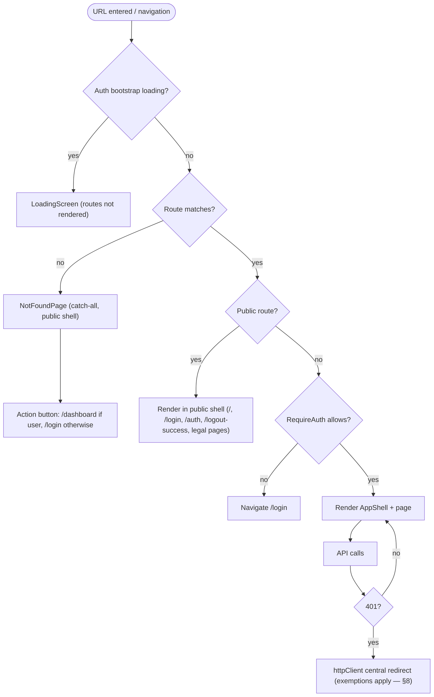
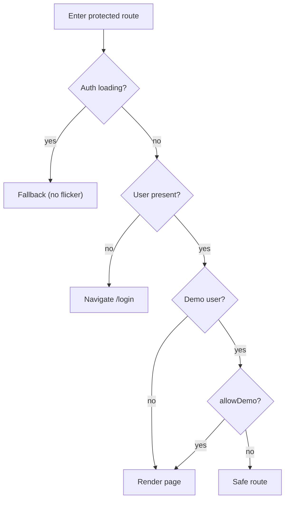

# §6 Runtime View

## Route Surface

| Route | Group | Notes |
|---|---|---|
| `/` | Public | Landing page ([§5.6](05-domains/home.md)) |
| `/login` | Public | SSO + demo entry; `?error=` renders a banner |
| `/auth` | Public | OAuth callback — verifies `/api/me`, then `/dashboard` |
| `/logout`, `/logout-success` | Public | Logout is public BY DESIGN (below) |
| `/dashboard` | Authenticated | KPI overview |
| `/inventory` | Authenticated | Inventory board |
| `/suppliers` | Authenticated | Suppliers board |
| `/analytics/:section?` | Authenticated | Optional section segment for deep links |
| `*` | Public | Single catch-all NotFound page (renders in the public shell) |

Public routes render in the public shell, authenticated routes in the app shell
([ADR-0005](09-decisions/adr-0005-shell-split-authenticated-vs-public.md)); the
router imports pages eagerly — no route-level code splitting (a deliberate,
revisitable choice; the page-module boundaries are the seams if it comes).

## Routing Flow

End-to-end navigation decisions: auth bootstrap gates route rendering, unknown
paths fall through to the catch-all inside the public shell, and the NotFound
page offers an action button that adapts to auth state (`/dashboard` when a user
is present, `/login` otherwise) — no automatic redirect.

## Guard Semantics (RequireAuth)

Two subtleties: `logoutInProgress` is treated like a loading state so the login
page never flashes during teardown, and demo users count as authenticated unless
a route omits `allowDemo`.

## Session Expiry & Logout Convergence

Session expiry never throws UI errors — the authenticated shell's
`useSessionTimeout` heartbeat detects an invalid session and navigates to
`/logout`, where cleanup and messaging live in exactly one place (React Query
cache clear, auth-state clear, top-level form POST to the backend, then
`/logout-success`). `/logout` is public so the flow works even as the session is
already gone; storage events let multiple tabs converge on the same logout.

## Startup

App start renders a global loading screen while `AuthProvider` bootstraps
(demo-session restore from localStorage, else `GET /api/me`), preventing guard
flicker; only then do routes render. Full auth flows: [§5.5](05-domains/auth.md).

## Routing Contract Tests

The routing invariants above (group membership, guard redirects, 404 fallback,
logout navigation) are protected by contract-style tests in the central suite —
changes to the route tree fail loudly rather than silently altering navigation.
