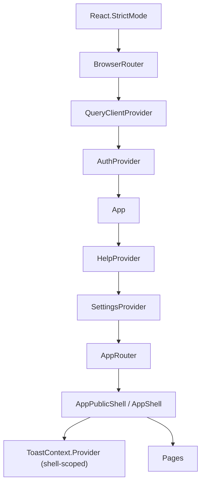
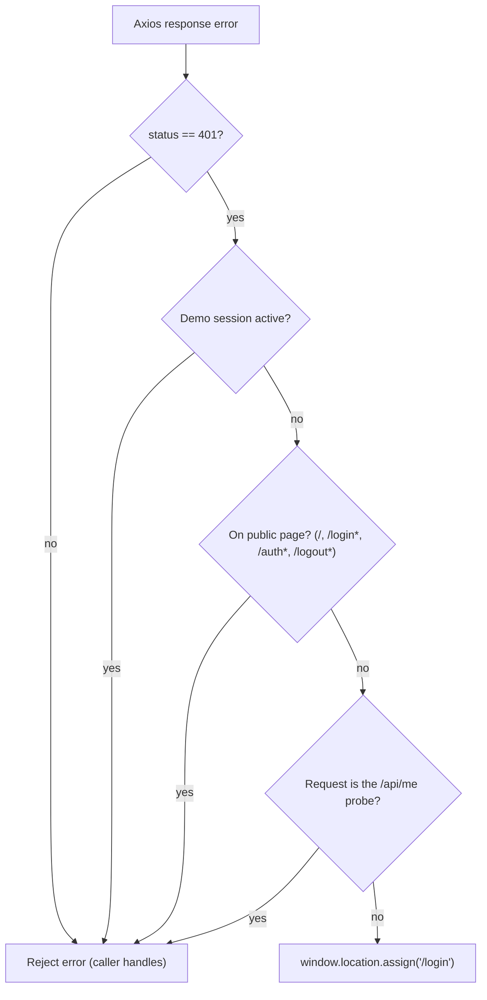

# §8 Concepts — State & Data Access

## Three Kinds of State

The frontend deliberately separates: **global cross-cutting state** in React
Context (auth session, user preferences, toast API, help panel), **local UI
state** in the owning component (dialog toggles, tab selections, form input),
and **server state** in TanStack React Query — never in Context — so caching,
retries, and background refresh stay uniform
([ADR-0006](09-decisions/adr-0006-global-state-with-context-modules.md)).

## The Four Providers

- **Auth** — single source of truth for `user`, `loading`, `logoutInProgress`;
  bootstrap hydration order is demo-session restore, then `GET /api/me`;
  cross-tab logout converges via storage events (details: [§5.5](05-domains/auth.md)).
- **Settings** — user preferences (date/number formatting, density) persisted to
  browser storage, plus backend system info with graceful fallbacks. Known
  tracked limitations: language changes can overwrite explicitly chosen formats,
  and parts of the preference set lack persistence (open items CB-APP33/34).
- **Toast** — `toast(message, severity?)`, hosted by the shells so leaf
  components stay shell-agnostic.
- **Help** — open/closed plus current `topicId`, closing on Escape.

App-level providers wrap routing and shells; the toast provider intentionally
lives in the shells. Access is uniformly through `createContextHook`-built hooks
that throw outside their provider.

## Provider Composition

Bootstrap wiring as it exists in `main.tsx` and `App.tsx`. Router and Query
provider sit outermost; auth wraps the app; help and settings live inside `App`
(help state is global, only the themed panel renders inside the shells); the
toast provider is intentionally shell-scoped — each shell supplies its own
implementation via `ToastContext.Provider`.

## Data Access Layering

Pages and components call **React Query hooks** (`src/api/**/hooks`), which call
**domain fetchers/mutations**, which use the one shared **`httpClient`** (Axios).
UI never imports Axios directly; fetchers never import UI
([ADR-0002](09-decisions/adr-0002-api-layer-abstraction-httpclient-and-domain-modules.md)).

`httpClient` semantics (from the module itself):

- Base URL from `VITE_API_BASE`: production bakes the backend host (rewritten to
  the frontend origin at serve time — [§7](07-deployment.md)); development uses
  the Vite proxy; a `/api` fallback exists defensively only.
- `withCredentials: true` on every call; `Accept: application/json` and
  `X-Requested-With` defaults; 30s timeout.
- **Central 401 handling** with three exemptions: public pages (`/`, `/login`,
  `/auth*`, `/logout*`) never redirect; the `/api/me` session probe never
  redirects; active demo sessions never redirect (demo has no server session, so
  401s are expected there). Everything else navigates to `/login` — feature code
  contains zero redirect logic.

## HTTP 401 Redirect Flow

The central interceptor decision path, exactly as implemented in
`src/api/httpClient.ts`:

## Tolerant Parsing & Errors

List fetchers tolerate multiple envelope shapes (bare array vs page object) and
normalize defensively; several return an empty page on network failure so grids
degrade instead of crashing. The `errorMessage()` helper extracts structured
messages when present, falls back to status-based text (400/401/403/404/409),
then to `Error.message`, then to a generic failure line — UI surfaces the string,
never a stack trace. Dialogs that must distinguish failure kinds do not read that
string: `extractApiError()` lifts the status, the status token and `fieldErrors`
out of the envelope, and the inventory and supplier form hooks classify from those.
