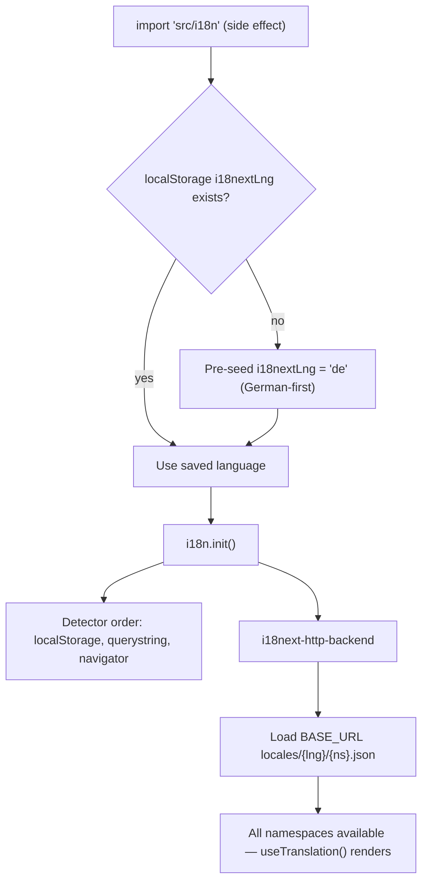

# §8b Concepts — Internationalization & Theming

## i18n Runtime

i18next + react-i18next, initialized as a side-effect import from the app entry
(`src/i18n/index.ts`). **German-first**: on first visit, the code pre-seeds
`localStorage.i18nextLng = 'de'` before the detector runs, guaranteeing the
German first impression while any later user choice persists. Detection order:
localStorage, then querystring (support/testing), then navigator.

Resources load at runtime via i18next-http-backend from
`${BASE_URL}locales/{lng}/{ns}.json` under `public/locales/{en,de}/`; the
canonical namespace list is a constant in the init module and all namespaces are
loaded up front. `resources.d.ts` types every namespace and key from the English
JSON, so `useTranslation('<ns>')` and `t('...')` are compile-time checked.

**Policy: no fallback strings in code.** A missing key must be added to BOTH
locale files; silent English is treated as a bug. Help content follows the same
rule — topics registered in `help/topics.ts` resolve `help:<topicId>.title/body`
keys. Dev builds expose the instance on `window.i18next` for debugging.

## i18n Boot Flow

## Theming

`buildTheme(locale, mode)` in `src/theme/index.ts` is the single factory: token
set (palette, typography, spacing, shape), merged MUI locale bundles (Material
core + X Data Grid, de/en) matching the i18n base language, `cssVariables`
output, and `responsiveFontSizes()`.

The enterprise-density baseline is enforced at theme level, not per screen:
`size="small"` defaults across form and list components, DataGrid
`density="compact"`, plus light chrome overrides (AppBar shadow, Drawer border,
Card/Paper radius). Rule of thumb: theme overrides for global consistency, `sx`
for one-off layout only.

A small `styles/global.css` covers what component styles handle awkwardly:
full-height root layout, webkit scrollbars, `.visually-hidden`, print overrides.
Two tracked open items live here: the scrollbar rules are duplicated between
global.css and the theme's CssBaseline (CB-APP15), and the print `!important`
overrides await an audit (CM-APP2). Hardcoded hex values in the supplier delete
dialogs are queued for theme-token migration (CB-APP99).
