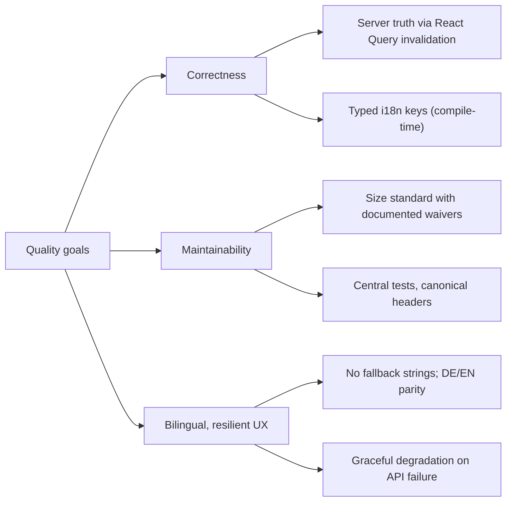

# §10 Quality Requirements

Refines the quality goals from [§1](index.md) into measurable, enforced
properties, each traceable to a chapter or decision.

## 10.1 Quality Tree

## 10.2 Enforced Scenarios

| Property | Enforcement | Where |
|---|---|---|
| Every push builds and passes the full suite | `tsc --noEmit` + `vitest run` in workflow 5 | [§7](07-deployment.md) |
| ~1,300 tests / ~86% line coverage, published per build | Vitest coverage to GitHub Pages | [§8c](08c-concepts-testing.md) |
| Translation keys valid at compile time | `resources.d.ts` typing from the EN JSON | [§8b](08b-concepts-i18n-theming.md) |
| Missing i18n keys are visible bugs | No-fallback policy; keys added to both locales | [§8b](08b-concepts-i18n-theming.md) |
| Mutations refresh exactly what they change | Query-family invalidation conventions | [§8](08-concepts.md) |
| Partial backend failure never blanks a page | Tolerant fetchers, empty-page fallbacks, per-block error states | [§8](08-concepts.md), [§5.4](05-domains/dashboard.md) |
| File and method size stay reviewable | Per-layer code-line caps; waivers documented in headers | [§2](02-constraints.md) |

Coverage is treated as risk management, not a score: strong coverage is demanded
on API hooks, workflow handlers, and validation/normalization logic; tiny
presentational wrappers are deliberately not chased.

## 10.3 Known Non-Goals

No end-to-end browser tests against a live backend (all suites are deterministic
with mocked boundaries), and no automated accessibility audit yet — RTL's
role/name queries enforce a baseline in component tests.
