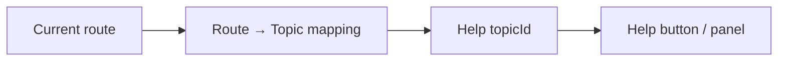

[⬅️ Back to App Shell Index](./index.md)

- [Back to Overview (English)](../overview.md)
- [Zurück zum Überblick (Deutsch)](../overview-de.md)

# Help Integration (Route → Help Topic)

This document describes the high-level approach for context-sensitive help: the UI derives a **help topic** from the current route and uses that topic to open the correct help content.

## Why route-based help?

- Users expect help to be relevant to the screen they are currently viewing.
- Routing is already a stable “source of context” for the application.
- A route → topic mapping keeps help integration consistent and testable.

## Conceptual model

## Architectural responsibilities

- The mapping from route to topic is centralized (so it can be updated without touching UI chrome everywhere).
- The shell determines the active topic from the current route.
- Shell chrome exposes help entry points (header and/or sidebar actions) using the active topic.

## Boundaries

Included:
- How the help topic is derived (route-based mapping)
- How the topic is passed into shell chrome

Excluded:
- Help content authoring, formatting, or storage (documented under the Help section)
- Feature-specific help copy (documented with the corresponding feature)

---

[Back to top](#top)
