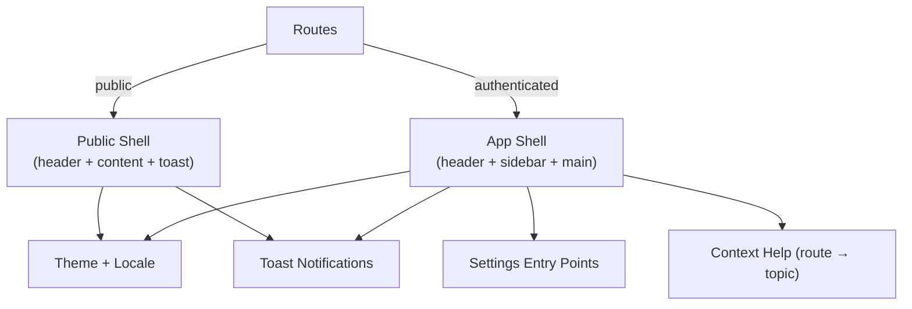

[⬅️ Back to Frontend Architecture Index](../index.md)

- [Back to Overview (English)](../overview.md)
- [Zurück zum Überblick (Deutsch)](../overview-de.md)

# App Shell

## 1️⃣ Section Purpose

This section documents the **App Shell**: the top-level UI structure that wraps pages and provides shared layout, global UI state, and cross-cutting user interactions.

It exists to keep application-wide concerns consistent (navigation chrome, header/sidebar, settings entry points, notifications) and to ensure the UI has a single, predictable place where these concerns are orchestrated.

Design decisions captured here include the “thin orchestrator” approach (shell coordinates, sub-components render), separation between authenticated vs. public shells, and how user preferences like theme and locale are applied consistently across the app.

## 2️⃣ Scope & Boundaries

Included:
- Shell composition and responsibilities (authenticated shell vs. public shell)
- Layout coordination (header / sidebar / main content orchestration)
- Global UI state owned by the shell (drawer open/close, settings dialog visibility)
- Cross-cutting UI capabilities surfaced through the shell (theme mode, locale switching, toast notifications)
- Preference persistence at shell level (e.g., theme and locale stored in browser storage)

Excluded:
- Feature/domain page structure (documented under [Domains](../domains/))
- API/data-fetching implementation details (documented under [Data Access](../data-access/))
- Component-level UI patterns (documented under [UI Components](../ui/))
- Detailed routing rules and route guards (documented under [Routing](../routing/))
- Authentication implementation (documented under the relevant auth sections)

## 3️⃣ High-Level Diagram

## 4️⃣ Section Map (Links to nested docs)

## Contents

- [Shell Variants (Public vs Authenticated)](shell-variants.md) - When the frontend uses the public shell vs. the authenticated shell and what each one is responsible for
- [Layout Composition (Header / Sidebar / Main)](layout-composition.md) - High-level layout structure and responsibilities of the main shell building blocks
- [Preference Persistence (Theme + Locale)](preference-persistence.md) - Where theme/locale live, why the shell owns them, and how preference behavior stays consistent
- [Toast Notifications](toast-notifications.md) - Shell-provided toast API for ephemeral feedback, with boundaries and usage intent
- [Settings Entry Points](settings-entry-points.md) - How global settings are exposed from application chrome and owned by the shell lifecycle
- [Help Integration (Route → Help Topic)](help-integration.md) - Route-based context help model and how the shell surfaces help entry points

---

[⬅️ Back to Frontend Architecture Index](../index.md)
