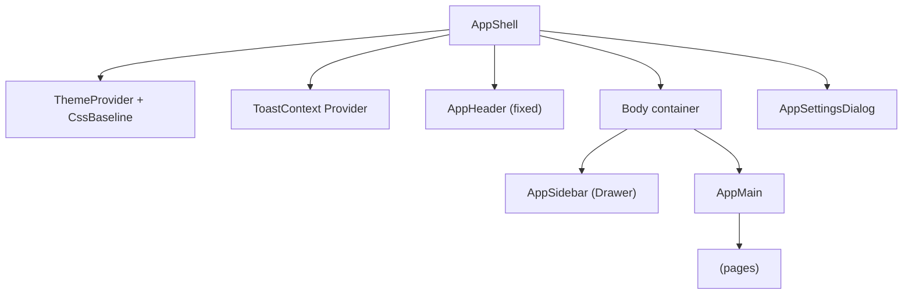
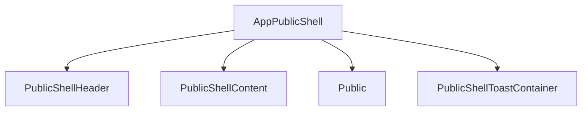

[⬅️ Back to App Shell Index](./index.md)

- [Back to Overview (English)](../overview.md)
- [Zurück zum Überblick (Deutsch)](../overview-de.md)

# Layout Composition (Header / Sidebar / Main)

This document explains the high-level layout composition of the authenticated App Shell and how it stays responsive and predictable.

## Composition principles

- The shell acts as a **thin orchestrator**: it coordinates state and delegates rendering.
- Layout is split into focused sub-components:
  - header (top bar actions and global status)
  - sidebar (navigation and footer actions)
  - main (page rendering via `<Outlet />`)

## Authenticated App Shell layout

### Header

The header is responsible for:
- app branding/title
- global status indicators (e.g., health/demo indicators)
- global actions (language toggle, theme toggle, help, hamburger menu)

### Sidebar

The sidebar is responsible for:
- navigation entry points (route list)
- user/profile and environment info display
- footer actions (theme/locale toggles, settings entry points, help)

The sidebar is responsive: typically temporary on small screens and permanent on larger screens.

### Main content

The main area:
- accounts for the fixed header height
- optionally displays a demo-mode banner
- renders the current route content using React Router’s `<Outlet />`

## Public shell layout (contrast)

Public pages use a simpler layout: header + content + toast container.

## Not covered here

- Navigation structure details (see [Routing](../routing/))
- UI component design system conventions (see [UI Components](../ui/))

---

[Back to top](#top)
