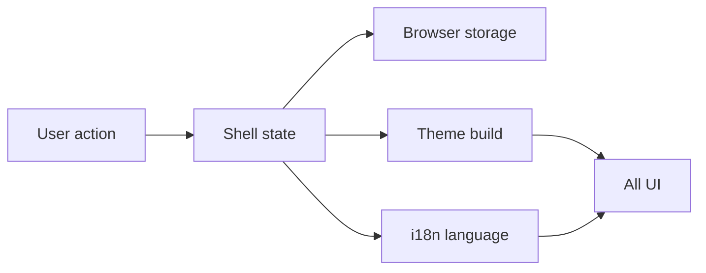

[⬅️ Back to App Shell Index](./index.md)

- [Back to Overview (English)](../overview.md)
- [Zurück zum Überblick (Deutsch)](../overview-de.md)

# Preference Persistence (Theme + Locale)

The App Shell owns user preference application for **theme mode** and **locale**, so the application behaves consistently across routes and refreshes.

## What is persisted?

- Theme mode: light/dark
- Locale: German/English

Persisting these preferences at the shell level ensures:
- a single “source of truth” for UI chrome
- consistent theming for pages, dialogs, and global components

## Where preferences live

- Preferences are owned by the active shell (public or authenticated).
- Downstream components receive the current values and callbacks via props.
- Internationalization is synchronized with the i18n runtime.

## Persistence mechanism (conceptual)

## Architectural decisions

- Preference persistence happens **in the shell**, not in feature code.
- Theme and locale are treated as **cross-cutting UI concerns**, so they are not reimplemented per page.
- The authenticated shell and public shell may differ in UI chrome, but preference behavior is consistent.

## Not covered here

- Theme token design and component styling conventions (see [Theming](../theming/))
- Date/number formatting strategies (documented with i18n and UI conventions)

---

[Back to top](#top)
