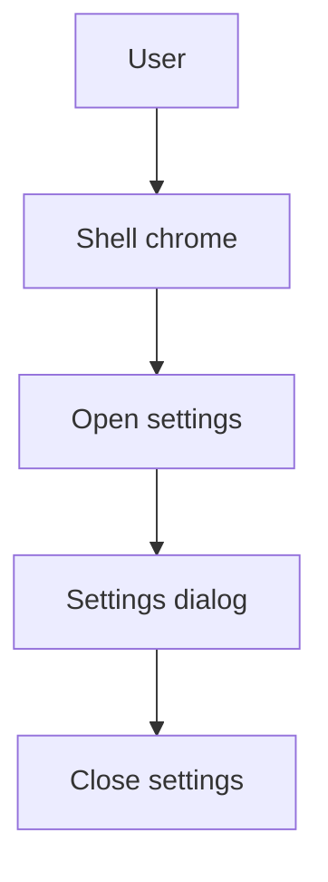

[⬅️ Back to App Shell Index](./index.md)

- [Back to Overview (English)](../overview.md)
- [Zurück zum Überblick (Deutsch)](../overview-de.md)

# Settings Entry Points

This document describes how application-wide settings are surfaced through the authenticated shell.

## Purpose

Settings are a cross-cutting concern: users should be able to access them consistently from the application chrome without needing to navigate to a specific feature page.

## Architectural approach

- The shell owns the “settings open/close” lifecycle.
- The settings UI is rendered as a dialog.
- Entry points live in shell chrome (e.g., sidebar actions).

## Conceptual model

## Scope & boundaries

Included:
- Where settings can be opened from (shell-level entry points)
- Shell-owned state for showing/hiding the settings dialog

Excluded:
- Specific settings fields and persistence rules (documented in the Settings section itself)
- Domain/feature configuration screens (documented under [Domains](../domains/))

---

[Back to top](#top)
