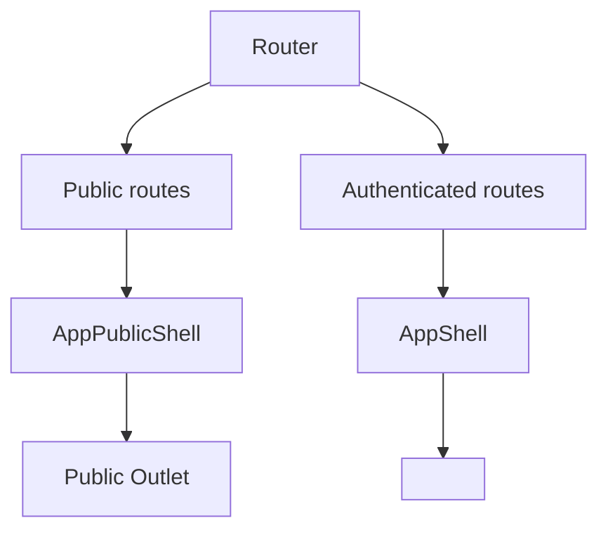

[⬅️ Back to App Shell Index](./index.md)

- [Back to Overview (English)](../overview.md)
- [Zurück zum Überblick (Deutsch)](../overview-de.md)

# Shell Variants (Public vs Authenticated)

The frontend uses two shell variants to keep the user experience consistent while separating concerns for **unauthenticated** and **authenticated** areas.

## Why two shells?

- Public pages (e.g., home/login/logout success) should be lightweight: minimal chrome, no sidebar, no profile.
- Authenticated pages need full navigation and global tooling (sidebar navigation, settings entry points, context help, session handling).
- Splitting the shells prevents feature creep into public pages and keeps the authenticated layout predictable.

## Shells at a glance

### Public Shell

- Purpose: Wraps unauthenticated pages with a minimal header and shared preferences.
- Typical elements: header + content area + toast notifications.
- Rendering model: public routes render inside a content wrapper.

### Authenticated Shell

- Purpose: Wraps authenticated routes with full application chrome and global orchestration.
- Typical elements: fixed header, responsive sidebar/drawer, main content with outlet, settings dialog, toast notifications.
- Rendering model: authenticated routes render inside the main content outlet.

## Conceptual routing-to-shell mapping

## Shared cross-cutting concerns (owned by the shell)

Both shells are responsible for applying and/or hosting:

- Theme + locale as user preferences
- A toast notification API via a shared toast context

The goal is that leaf components can trigger user feedback (toasts) without needing to know which shell is currently active.

## Not covered here

- Exact route definitions and guards (see [Routing](../routing/))
- Page-level concerns and domain organization (see [Domains](../domains/))

---

[Back to top](#top)
