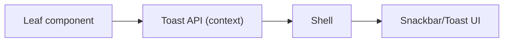

[⬅️ Back to App Shell Index](./index.md)

- [Back to Overview (English)](../overview.md)
- [Zurück zum Überblick (Deutsch)](../overview-de.md)

# Toast Notifications

This document describes the shell-level toast notification capability used for transient user feedback (success/info/warning/error).

## Purpose

Toasts provide a consistent, low-friction way to communicate short-lived events (e.g., “saved”, “copied”, “mode changed”) without coupling leaf components to shell layout.

## Architectural approach

- A shared toast context exposes a single function:
  - `toast(message, severity?)`
- Both shells provide the context so leaf components can call the same API regardless of authentication state.

## Conceptual flow

## Severity levels

The toast API supports standard severities:
- success
- info
- warning
- error

## Boundaries

Included:
- Toast API contract and where it is provided (shell)
- User experience guidelines for short, ephemeral messages

Excluded:
- Centralized error handling strategy for failed network calls (documented under [Data Access](../data-access/))
- Domain-specific notification rules (documented under the relevant domain sections)

---

[Back to top](#top)
