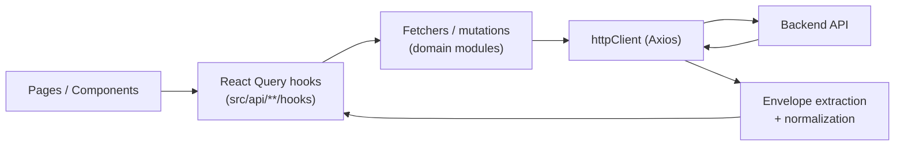

[⬅️ Back to Frontend Architecture Index](../index.md)

- [Back to Overview (English)](../overview.md)
- [Zurück zum Überblick (Deutsch)](../overview-de.md)

# Data Access

## 1️⃣ Section Purpose

This section documents how the frontend **talks to the backend** and how API responses are shaped into UI-ready data.

The goal is to make data access:
- predictable (consistent layering and query keys)
- resilient (tolerant parsing and user-friendly errors)
- testable (API logic stays out of components)

## 2️⃣ Scope & Boundaries

Included:
- The shared HTTP client and cross-cutting request/response behavior
- Domain API modules under `frontend/src/api/*` (inventory, suppliers, analytics)
- Parsing/normalization utilities (envelopes, type guards, field pickers)
- React Query hooks (query keys, caching, conditional fetching)

Excluded:
- Authentication UI flows and route-guards (see [Routing](../routing/index.md))
- Global app state providers (see [State](../state/index.md))
- UI component details (see [UI Components](../ui/))

## 3️⃣ High-Level Diagram

## 4️⃣ Section Map (Links to nested docs)

## Contents

- [Layering & Contracts](layering-and-contracts.md) - The intended dependency direction and what UI code should (and should not) import
- [HTTP Client & Auth Boundaries](http-client-and-auth.md) - Base URL, cookies (`withCredentials`), and 401 redirect rules
- [React Query Hooks](react-query-hooks.md) - Query keys, caching (`staleTime`/`gcTime`), and `enabled` conditions
- [Response Shapes & Normalization](response-shapes-and-normalization.md) - Envelope tolerance (array vs Page) and defensive normalizers
- [Errors & Fallbacks](errors-and-fallbacks.md) - Converting failures into user-friendly messages and safe UI defaults
- [Connectivity & Session Probes](connectivity-and-session-probes.md) - Health/db check and `/api/me` session validation

---

[⬅️ Back to Frontend Architecture Index](../index.md)
