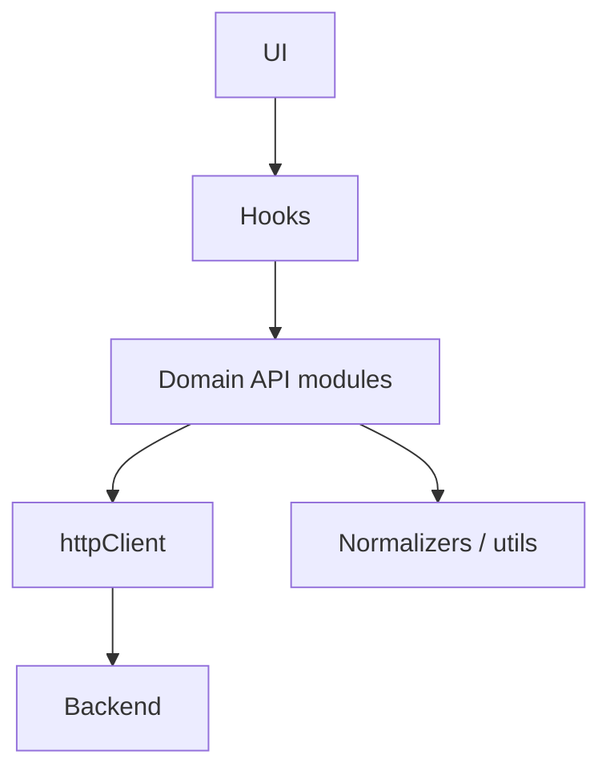

[⬅️ Back to Data Access Index](./index.md)

- [Back to Overview (English)](../overview.md)
- [Zurück zum Überblick (Deutsch)](../overview-de.md)

# Layering & Contracts

The API layer is structured so that UI code can consume **stable hooks and typed models**, without depending on Axios details or backend-specific response envelopes.

## The intended layering

- **UI (pages/components)** should call React Query hooks or domain-level functions.
- **Hooks (`src/api/**/hooks`)** define caching, query keys, and conditional fetching.
- **Fetchers/mutations (`src/api/<domain>/*`)** perform HTTP calls and return UI-friendly models.
- **Shared client (`src/api/httpClient.ts`)** centralizes base URL, cookie behavior, and cross-cutting response handling.
- **Utilities/normalizers (`src/api/**/utils*`)** tolerate response shape variations and prevent UI breakage.

## Dependency direction (keep it one-way)

The API layer should depend “inwards” only:

Rules of thumb:
- UI should not import Axios types or `httpClient` directly.
- Domain modules may import `httpClient` and shared utilities.
- Utilities should stay pure (no React, no component imports).

## Domain boundaries in this repo

- `src/api/inventory/*` - inventory list/detail, stock/price mutations, and inventory-specific normalizers
- `src/api/suppliers/*` - suppliers list/detail and normalizers
- `src/api/analytics/*` - analytics endpoints + hooks for dashboards and charts

These domains use “barrel exports” (`index.ts`) to keep imports stable while the code evolves.

---

[Back to top](#top)
