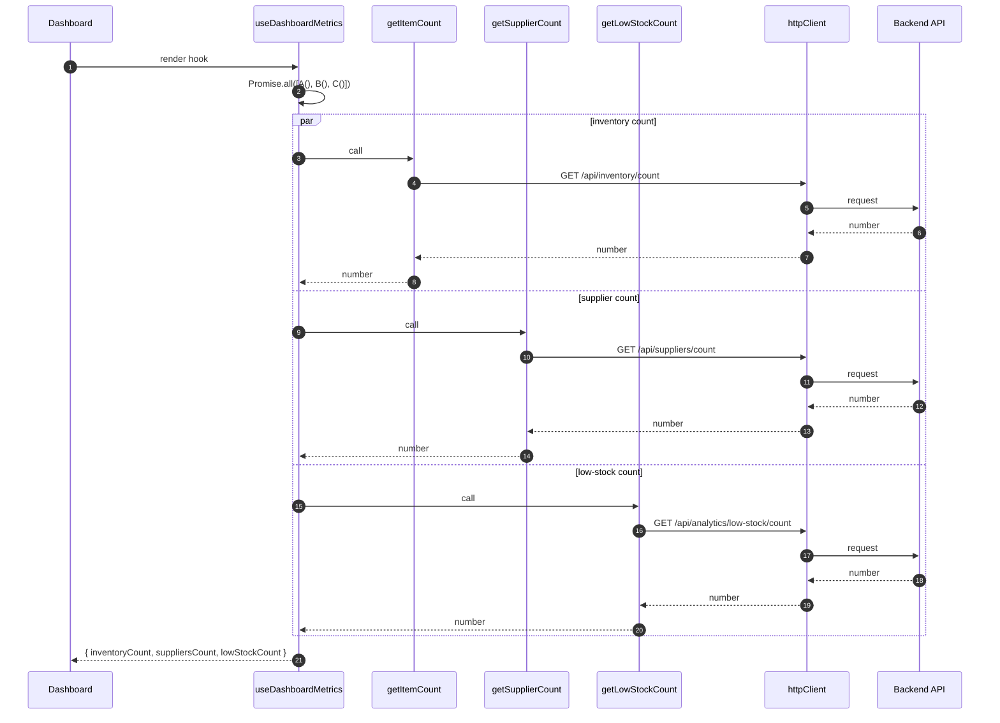

[⬅️ Back to Diagrams Index](./index.md)

- [Back to Architecture Index](../index.md)
- [Back to Overview (English)](../overview.md)
- [Zurück zum Überblick (Deutsch)](../overview-de.md)
- [Back to Data Access](../data-access/index.md)

# Dashboard metrics parallel fetching

The dashboard KPI hook aggregates multiple backend calls in parallel.

---

[Back to top](#top)
