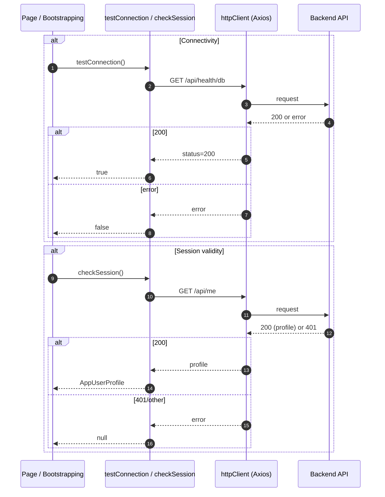

[⬅️ Back to Diagrams Index](../index.md)

- [Back to Architecture Index](../../index.md)
- [Back to Overview (English)](../../overview.md)
- [Zurück zum Überblick (Deutsch)](../../overview-de.md)
- [Back to Data Access](../../data-access/index.md)

# Connectivity + session probes

The frontend uses lightweight probes for “is the backend up?” and “is this session valid?”.

Important boundary:
- `/api/me` is a probe and should not trigger global redirects.

---

[Back to top](#top)
