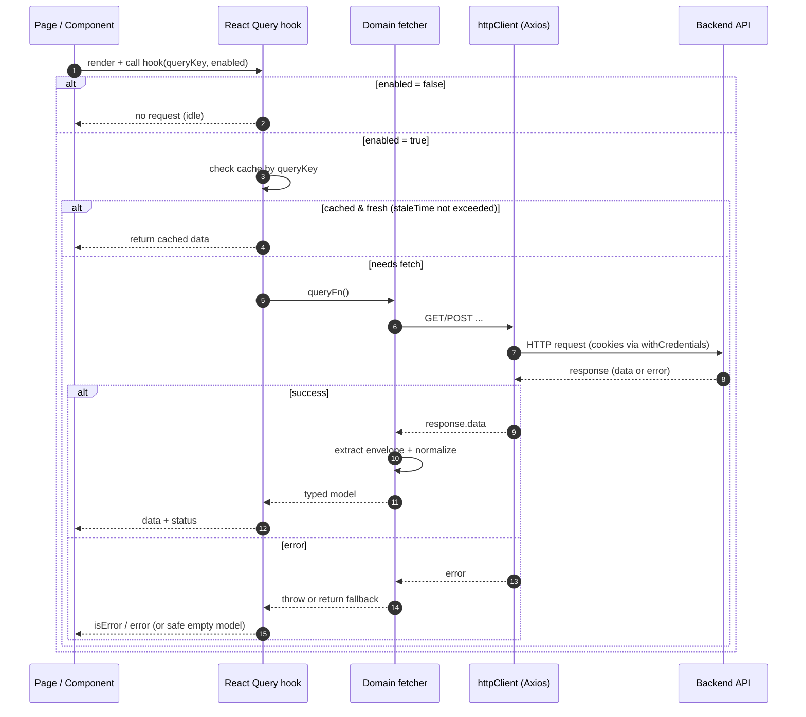

[⬅️ Back to Diagrams Index](../index.md)

- [Back to Architecture Index](../../index.md)
- [Back to Overview (English)](../../overview.md)
- [Zurück zum Überblick (Deutsch)](../../overview-de.md)
- [Back to Data Access](../../data-access/index.md)

# Data fetching flow (React Query)

This diagram shows the typical flow for server-state reads (lists, details, analytics) using React Query hooks and domain fetchers.

---

[Back to top](#top)
