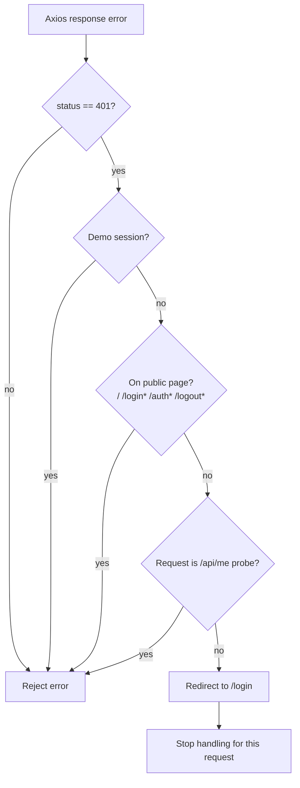

[⬅️ Back to Diagrams Index](./index.md)

- [Back to Architecture Index](../index.md)
- [Back to Overview (English)](../overview.md)
- [Zurück zum Überblick (Deutsch)](../overview-de.md)
- [Back to Data Access](../data-access/index.md)

# HTTP client 401 redirect flow

Unauthorized responses are handled centrally by the Axios response interceptor in `src/api/httpClient.ts`.

Notes:
- `/api/me` is treated as a probe endpoint and should not force navigation.
- Public pages avoid redirect loops and flicker.

---

[Back to top](#top)
