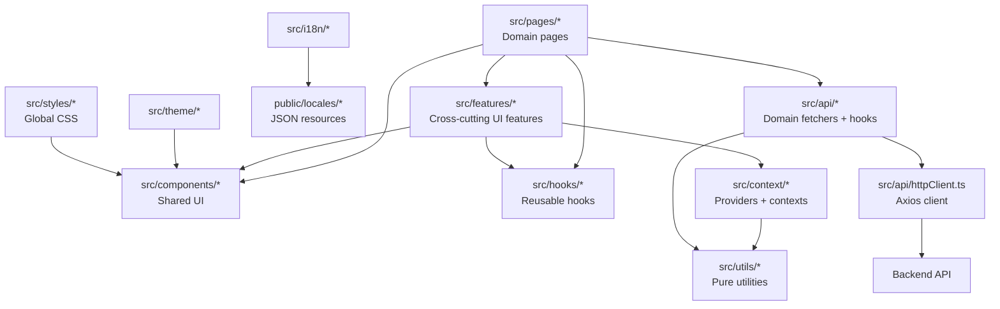

[⬅️ Back to Diagrams Index](../index.md)

- [Back to Architecture Index](../../index.md)
- [Back to Overview (English)](../../overview.md)
- [Zurück zum Überblick (Deutsch)](../../overview-de.md)

# Frontend module map

A map of the major frontend modules and the intended dependency direction.

Rules of thumb:
- Pages should consume stable hooks/components, not Axios details.
- Cross-cutting features (help/health) use contexts + hooks and stay reusable.

---

[Back to top](#top)
