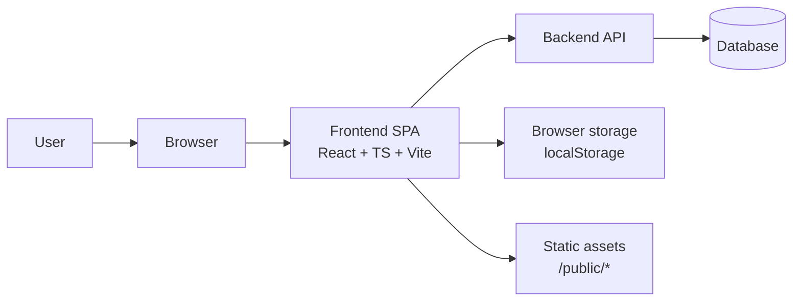

[⬅️ Back to Diagrams Index](../index.md)

- [Back to Architecture Index](../../index.md)
- [Back to Overview (English)](../../overview.md)
- [Zurück zum Überblick (Deutsch)](../../overview-de.md)

# System overview

High-level system context for the frontend SPA.

Notes:
- The SPA talks to the backend via HTTP (cookies/credentials as needed).
- Localization JSON bundles are served as static assets from `/public/locales/*`.

---

[Back to top](#top)
