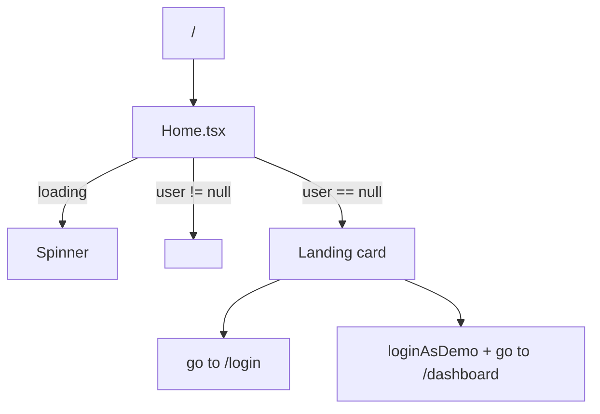

[⬅️ Back to Home Domain](./index.md)

- [Back to Overview (English)](../../overview.md)
- [Zurück zum Überblick (Deutsch)](../../overview-de.md)

# Home Landing Flow & Demo Entry

`Home.tsx` is the root-route landing hub. It performs *no HTTP calls* and only routes users based on auth state.

## Where it lives

- Page: `frontend/src/pages/home/Home.tsx`
- Auth state + demo action: `frontend/src/context/auth/AuthContext.ts` via `useAuth()`

## Routing rules

Home uses three states:

1) **Auth is hydrating** (`loading === true`)
- render a centered spinner

2) **Authenticated** (`user !== null`)
- redirect to `/dashboard` with `<Navigate replace />`

3) **Unauthenticated** (`user === null`)
- render a minimal landing card with two actions:
  - Sign in → navigate to `/login`
  - Continue in Demo Mode → `loginAsDemo()` then navigate to `/dashboard` (replace)

## Demo mode entry

Home’s demo button calls:

- `useAuth().loginAsDemo()`

`loginAsDemo()`:
- sets a synthetic user with `role: 'DEMO'` and `isDemo: true`
- persists the demo user in `localStorage` under `ssp.demo.session`

This persistence keeps refresh/deep-links usable for demo sessions.

## i18n contract

Home uses the `auth` namespace for copy:
- `welcome`
- `or`
- `signIn`
- `continueDemo` (fallback provided)
- `ssoHint`

## Conceptual flow

---

[Back to top](#top)
