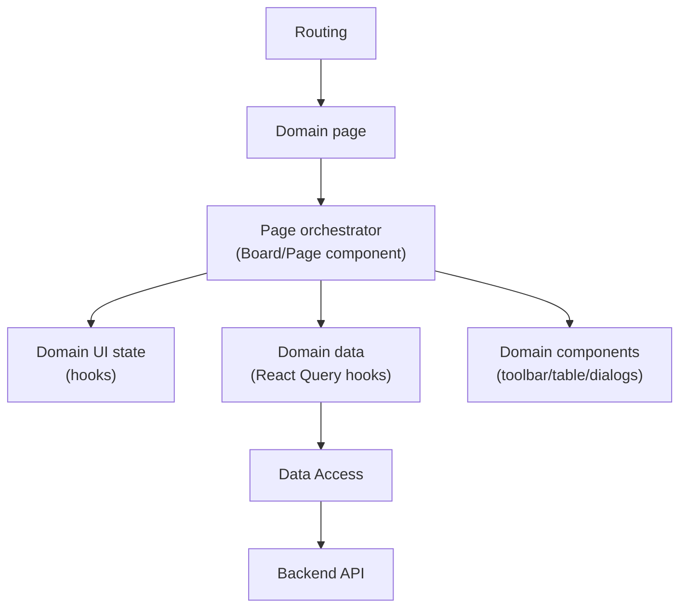

[⬅️ Back to Frontend Architecture Index](../index.md)

- [Back to Overview (English)](../overview.md)
- [Zurück zum Überblick (Deutsch)](../overview-de.md)

# Domains

## 1️⃣ Section Purpose

This section documents the frontend as a set of **domain-oriented pages** (Inventory, Suppliers, Analytics, …).

The goal is to make it clear:
- where each “business area” lives in the code (`src/pages/<domain>`)
- which responsibilities belong to the page orchestrator vs. sub-components
- how each domain depends on cross-cutting layers (routing, state, data-access)

## 2️⃣ Scope & Boundaries

Included:
- Domain page folders under `frontend/src/pages/*`
- Page orchestration patterns (composition of hooks, handlers, dialogs, tables)
- Domain boundaries and “what belongs here” rules of thumb

Excluded:
- Global layout/shell responsibilities (see [App Shell](../app-shell/index.md))
- Global routing rules and guards (see [Routing](../routing/index.md))
- Shared API client + caching/normalization strategy (see [Data Access](../data-access/index.md))
- Shared UI component conventions (see [UI Components](../ui/))

## 3️⃣ High-Level Diagram

## 4️⃣ Section Map (Domains)

## Implemented (so far)

- [Auth](./auth/index.md) - Login/callback/logout pages (`src/pages/auth`), Demo Mode, and session hydration integration
- [Home](./home/index.md) - Root landing page (`src/pages/home`) that routes users to login, demo, or dashboard
- [Inventory](./inventory/index.md) - Inventory Management page (`src/pages/inventory`) and its orchestrator composition
- [Suppliers](./suppliers/index.md) - Suppliers Management page (`src/pages/suppliers`) with browse + search + CRUD dialogs
- [Analytics](./analytics/index.md) - Analytics page (`src/pages/analytics`) with URL-driven sections, filters, and block-based data fetching
- [Dashboard](./dashboard/index.md) - Dashboard page (`src/pages/dashboard`) with KPIs, compact movement chart, and navigation shortcuts
- [System](./system/index.md) - System-level pages (`src/pages/system`), currently the global 404 fallback

## Planned (next)

- (none right now)

---

[⬅️ Back to Frontend Architecture Index](../index.md)
