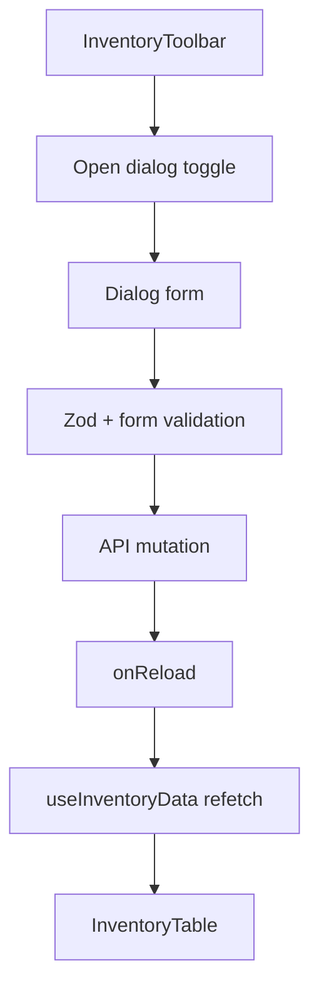

[⬅️ Back to Inventory Domain](./index.md)

- [Back to Overview (English)](../../overview.md)
- [Zurück zum Überblick (Deutsch)](../../overview-de.md)

# Inventory Dialogs & Mutations

Inventory write operations are implemented as dialogs that are **controlled by the board** and **own their own form/query/mutation logic**.

## Dialog collection

`InventoryDialogs` is a pure “dialog switchboard” component:
- It receives open/close props for each dialog.
- It receives `selectedRow` from the board.
- It receives `isDemo` to enforce read-only demo behavior.

## Dialogs and workflows

### Create / Edit (ItemFormDialog)

- Component: `dialogs/ItemFormDialog/ItemFormDialog.tsx`
- Mode:
  - Create mode when `initial` is undefined
  - Edit mode when `initial.id` exists

Characteristics:
- Title and submit button label change based on mode.
- Submission state is tracked (`formState.isSubmitting`).
- Help is opened via a hash route (e.g. `#/help?section=create_item`).

### Rename item (EditItemDialog)

- Component: `dialogs/EditItemDialog/EditItemDialog.tsx`
- Guided workflow:
  1) select supplier
  2) search/select item
  3) enter new name
  4) submit

Notes:
- The code documents it as an ADMIN-only operation; the backend is the source of truth for authorization.

### Adjust quantity (QuantityAdjustDialog)

- Component: `dialogs/QuantityAdjustDialog/QuantityAdjustDialog.tsx`
- Guided workflow:
  1) select supplier
  2) select item
  3) enter new quantity
  4) choose a reason
  5) submit

Notes:
- The submit button is disabled unless an item is selected.
- The dialog accepts `readOnly` to block mutation in demo mode.

### Change price (PriceChangeDialog)

- Component: `dialogs/PriceChangeDialog/PriceChangeDialog.tsx`
- Guided workflow:
  1) select supplier
  2) select item
  3) enter new price
  4) submit

Notes:
- The dialog accepts `readOnly` to block mutation in demo mode.

### Delete item (DeleteItemDialog)

- Component: `dialogs/DeleteItemDialog/DeleteItemDialog.tsx`
- Two-step flow:
  1) Form dialog: supplier → item → reason
  2) Confirmation dialog: warning + final confirmation

Notes:
- Backend requires quantity to be `0` before allowing deletion.
- Marked as ADMIN-only in code docs.
- `readOnly` is supported for demo sessions.

## Reload behavior

All dialogs accept a callback (`onSaved`, `onAdjusted`, `onPriceChanged`, `onItemDeleted`, etc.).
The board wires these to a single “reload” handler so the table refreshes after mutations.

## Conceptual flow

---

[Back to top](#top)
