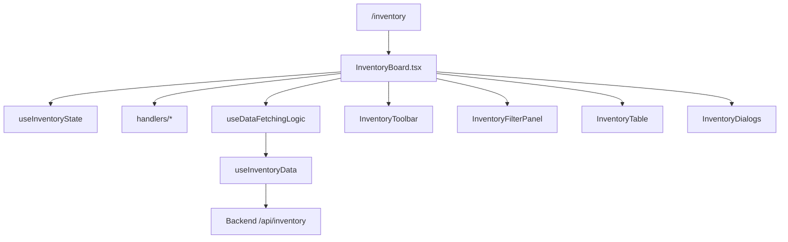

<a id="top"></a>

[⬅️ Back to Inventory Domain](./index.md)

- [Back to Overview (English)](../../overview.md)
- [Zurück zum Überblick (Deutsch)](../../overview-de.md)

# Inventory Page Orchestration (InventoryBoard)

`InventoryBoard.tsx` is the Inventory domain’s **page orchestrator**. It composes state, handlers, and data, and keeps all dialogs controlled from one place.

## Responsibilities

Owned by `InventoryBoard`:
- Instantiate the domain state (`useInventoryState`).
- Assemble event handlers (toolbar, filters, table).
- Assemble data fetching + derived UI data (`useDataFetchingLogic`).
- Decide what to render when no supplier is selected (prompt vs table).
- Own dialog visibility and pass `selectedRow` + `isDemo` down.

Not owned by `InventoryBoard`:
- API request mechanics (Axios, interceptors, normalization) → [Data Access](../../data-access/index.md)
- Auth state and route guards → [Auth domain](../auth/index.md), [Routing](../../routing/index.md)

## Composition overview

Key imports (conceptually):
- State: `useInventoryState`
- Handlers: `useToolbarHandlers`, `useFilterHandlers`, `useTableHandlers`, `useRefreshHandler`
- Data: `useDataFetchingLogic` → `useInventoryData`
- UI: `InventoryToolbar`, `InventoryFilterPanel`, `InventoryTable`, `InventoryDialogs`

## Selected-row behavior

The board resolves the current selection by joining:
- UI selection: `state.selectedId`
- Server items: `data.server.items`

```ts
const selectedRow = data.server.items.find((r) => r.id === state.selectedId) ?? null;
```

That `selectedRow` is passed into `InventoryDialogs` so dialogs can pre-fill edit forms.

## Demo mode plumbing

The board computes demo mode once:
- `const isDemo = Boolean(user?.isDemo)`

…and passes it into dialogs as `readOnly`/`isDemo` so write operations are blocked in demo sessions.

## Conceptual flow



---

[Back to top](#top)
