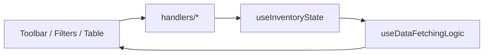

[⬅️ Back to Inventory Domain](./index.md)

- [Back to Overview (English)](../../overview.md)
- [Zurück zum Überblick (Deutsch)](../../overview-de.md)

# Inventory State & Handlers

Inventory keeps UI state centralized and pushes update logic into small handler hooks.

## State model

`useInventoryState` is the single source of truth for:

- Filters
  - `supplierId`: selected supplier (required to load items)
  - `q`: search string
  - `belowMinOnly`: boolean toggle

- Pagination & sorting (MUI DataGrid)
  - `paginationModel`: `{ page, pageSize }` (0-based)
  - `sortModel`: array with a primary `{ field, sort }`

- Selection
  - `selectedId`: selected row id

- Dialog toggles
  - `openNew`, `openEdit`, `openEditName`, `openDelete`, `openAdjust`, `openPrice`

## Handler hooks

### Filter handlers

`useFilterHandlers` encodes a few important invariants:
- Changing supplier resets dependent state:
  - clears selection (`selectedId = null`)
  - clears query (`q = ''`)
  - resets pagination to first page (`page = 0`)

- Toggling “below minimum only” resets pagination to first page.

### Table handlers

`useTableHandlers` is intentionally thin:
- row click → set `selectedId`
- pagination change → set `paginationModel`
- sort change → set `sortModel`

### Toolbar handlers

`useToolbarHandlers` maps buttons to dialog toggles:
- Add New → `openNew = true`
- Edit → `openEditName = true`
- Delete → `openDelete = true`
- Adjust Quantity → `openAdjust = true`
- Change Price → `openPrice = true`

### Refresh handler

`useRefreshHandler` is a “soft reload”:
- resets pagination to page 0
- increments a refresh signal so the inventory query refetches

(Exact mechanism is internal to the handler/hook chain.)

## Conceptual flow

---

[Back to top](#top)
