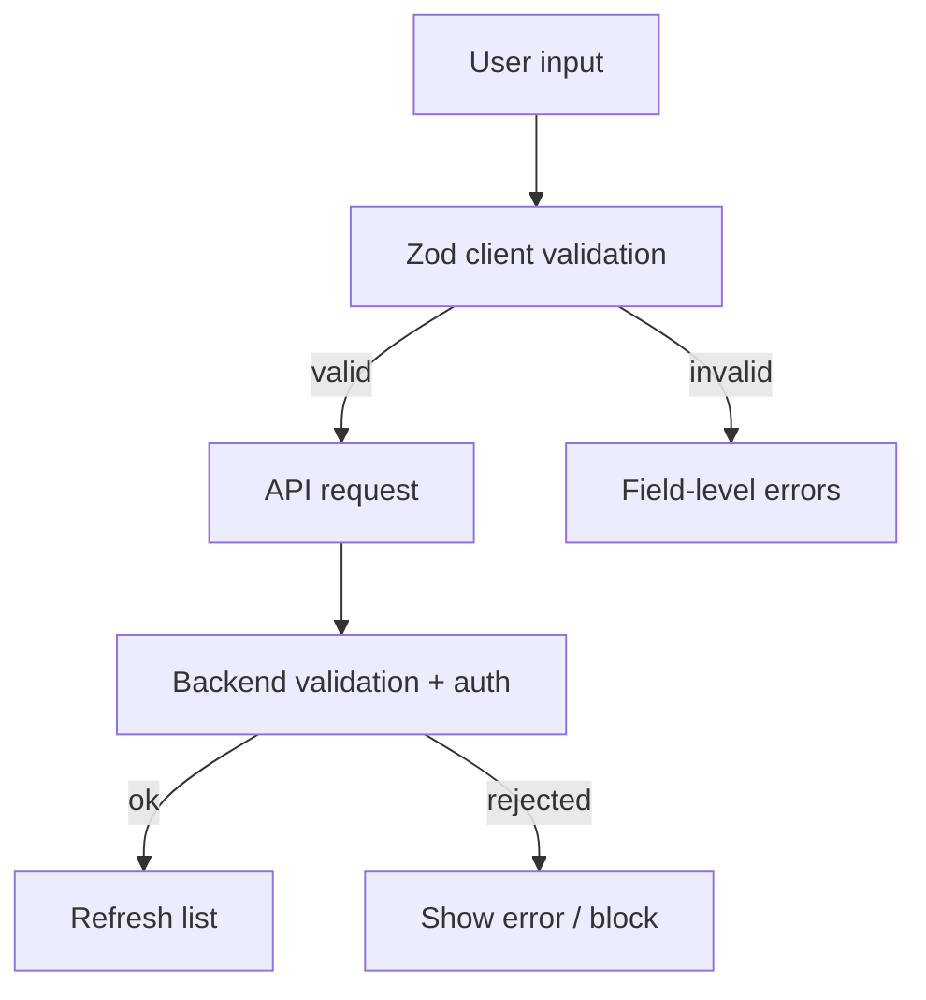

[⬅️ Back to Inventory Domain](./index.md)

- [Back to Overview (English)](../../overview.md)
- [Zurück zum Überblick (Deutsch)](../../overview-de.md)

# Inventory Validation & Authorization

Inventory uses Zod schemas for consistent client-side validation, while relying on the backend as the source of truth for authorization and final business rules.

## Validation schemas

Location: `frontend/src/pages/inventory/validation/inventoryValidation.ts`

Schemas include:

- `itemFormSchema` (create/update item)
  - requires: `name`, `supplierId`
  - non-negative: `quantity`, `price`
  - `reason` enum (`INITIAL_STOCK` | `MANUAL_UPDATE`)

- `quantityAdjustSchema`
  - requires: `itemId`, `reason`
  - non-negative: `newQuantity`

- `priceChangeSchema`
  - requires: `itemId`
  - positive: `newPrice` (> 0)

- `editItemSchema`
  - requires: `itemId`, `newName`
  - backend additionally enforces name uniqueness per supplier

- `deleteItemSchema`
  - requires: `itemId`

## Authorization and server-side rules

The UI documents a few operations as restricted:

- Rename item: ADMIN-only (backend enforced)
- Delete item: ADMIN-only (backend enforced)

Additionally, deletion is guarded by a business invariant:
- item quantity must be `0` before deletion is accepted

These rules should be treated as **server-owned**. The UI aims to guide the user, but the backend decides.

## Demo mode behavior

Demo sessions are intended to be read-only:
- dialogs that mutate server state accept a `readOnly` prop (wired from `isDemo`)
- demo users can still navigate the UI and open dialogs, but submission is blocked

## Conceptual model

---

[Back to top](#top)
