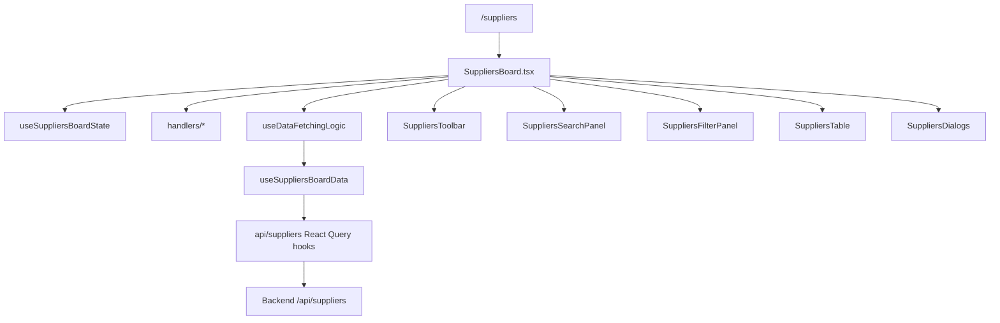

[⬅️ Back to Suppliers Domain](./index.md)

- [Back to Overview (English)](../../overview.md)
- [Zurück zum Überblick (Deutsch)](../../overview-de.md)

# Suppliers Page Orchestration (SuppliersBoard)

`SuppliersBoard.tsx` is the Suppliers domain’s page orchestrator. It composes state, handler hooks, data shaping, and presentational components.

## Responsibilities

Owned by `SuppliersBoard`:
- Instantiate the domain UI state (`useSuppliersBoardState`).
- Bind handler hooks for toolbar/search/filter/table/dialog events.
- Shape state into server-friendly parameters via `useDataFetchingLogic`.
- Decide which rows to display (search-selection mode vs paginated mode).
- Own dialog open/close wiring and refresh callbacks.

Not owned by `SuppliersBoard`:
- HTTP client behavior, error normalization, and shared request policies → [Data Access](../../data-access/index.md)
- Global auth/route gating → [Routing](../../routing/index.md)

## Composition overview

`SuppliersBoard` wires these layers:

- State: `hooks/useSuppliersBoardState.ts`
- Handlers: `handlers/*`
- Data: `handlers/useDataFetchingLogic.ts` → `hooks/useSuppliersBoardData.ts` → `api/suppliers/*`
- UI:
  - `SuppliersToolbar`
  - `SuppliersSearchPanel`
  - `SuppliersFilterPanel`
  - `SuppliersTable`
  - `SuppliersDialogs` (Create/Edit/Delete)

## Display modes (row selection vs full list)

The board uses a simple rule to decide what the table shows:

1) If the user selected a supplier from the search dropdown:
- show only that supplier (single-row “focus mode”)

2) Else if “Show all suppliers” is enabled:
- show the paginated table

3) Else:
- show an empty-state placeholder

This is encoded via `displayRows` and `displayRowCount`.

## Dialog lifecycle wiring

Dialogs are controlled from the board:
- open state lives in `useSuppliersBoardState`
- close handlers call setters and allow form hooks to reset
- onCreated/onUpdated/onDeleted callbacks route through `useDialogHandlers` to:
  - toast a status message
  - invalidate suppliers queries (`queryKey: ['suppliers']`)
  - close dialogs and clear selection where appropriate

## Conceptual flow

---

[Back to top](#top)
