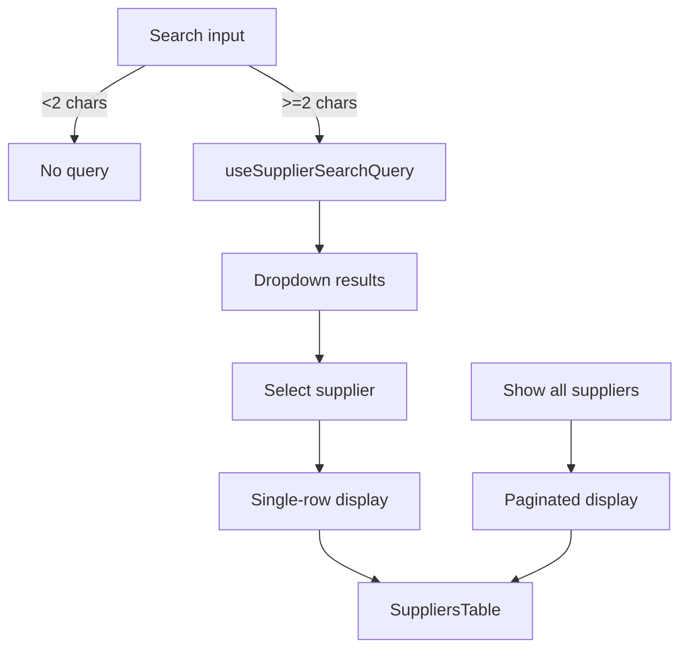

[⬅️ Back to Suppliers Domain](./index.md)

- [Back to Overview (English)](../../overview.md)
- [Zurück zum Überblick (Deutsch)](../../overview-de.md)

# Suppliers Search & Display Modes

Suppliers has two user-facing ways to find suppliers:

1) a type-ahead search dropdown (focus on a single supplier)
2) an explicit “show all suppliers” toggle (browse the paginated list)

These are designed to avoid rendering a large table by default.

## Search dropdown behavior

Component: `SuppliersSearchPanel`

- The input hints `min 2 chars`.
- Results render in an overlay dropdown only when:
  - there are results, and
  - no supplier is currently selected (`selectedSupplier` is null)

Selecting a supplier from the dropdown:
- sets `selectedSearchResult`
- sets `selectedId` (enables edit/delete buttons)
- resets pagination to page 0
- updates `searchQuery` to the supplier name

Clearing the selection:
- clears `selectedSearchResult`
- clears `selectedId`
- clears `searchQuery`

## Display mode selection (what the table shows)

`SuppliersBoard` computes table rows using:

- `hasSelectedFromSearch = selectedSearchResult !== null`

Then:

- If `hasSelectedFromSearch`:
  - `displayRows` is `[selectedSearchResult]`
  - `displayRowCount` is `1`

- Else if `showAllSuppliers`:
  - `displayRows` is `data.suppliers`
  - `displayRowCount` is `data.total`

- Else:
  - the table is hidden and an empty placeholder is shown

This design keeps the default page lightweight (no automatic paginated fetch needed to show the table).

## Interaction between search and “show all”

Search selection takes precedence: once a supplier is selected from search, the board shows the single-row mode regardless of `showAllSuppliers`.

## Conceptual flow

---

[Back to top](#top)
