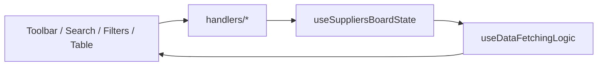

[⬅️ Back to Suppliers Domain](./index.md)

- [Back to Overview (English)](../../overview.md)
- [Zurück zum Überblick (Deutsch)](../../overview-de.md)

# Suppliers State & Handlers

Suppliers uses the same pattern as other domains: a single state hook plus small handler hooks that mutate that state.

## State model

`useSuppliersBoardState` is the single source of truth for:

- Search & filter
  - `searchQuery`: free text (used for dropdown search and optionally server list filtering)
  - `showAllSuppliers`: whether the paginated list is shown

- Pagination & sorting (MUI DataGrid)
  - `paginationModel`: `{ page, pageSize }` (0-based)
  - `sortModel`: array with a primary `{ field, sort }`

- Selection
  - `selectedId`: currently selected table row id (string)
  - `selectedSearchResult`: supplier selected from the search dropdown (single-row mode)

- Dialog toggles
  - `openCreate`, `openEdit`, `openDelete`

## Handler hooks

### Toolbar handlers

`useToolbarHandlers` is straightforward:
- Create → `openCreate = true`
- Edit → `openEdit = true`
- Delete → `openDelete = true`

The actual enable/disable state is computed in `SuppliersBoard`.

### Search handlers (selection + reset invariants)

`useSearchHandlers` encodes important reset rules:

- On search text change:
  - updates `searchQuery`
  - clears `selectedSearchResult` and `selectedId`
  - resets pagination to page 0

- On selecting a result:
  - sets `selectedSearchResult` and `selectedId`
  - resets pagination to page 0
  - sets `searchQuery` to the supplier name (keeps input consistent)

- On clearing selection:
  - clears `selectedSearchResult`, `selectedId`, and `searchQuery`

### Filter handlers

`useFilterHandlers` toggles `showAllSuppliers`.

### Table handlers

`useTableHandlers` keeps DataGrid wiring thin:
- row click → `selectedId = row.id`
- pagination change → set `paginationModel`
- sort change → set `sortModel`

### Dialog result handlers

`useDialogHandlers` centralizes the post-mutation behavior:
- toast a success message
- invalidate React Query caches under `['suppliers']`
- close the dialog
- clear selection after edit/delete

## Conceptual flow

---

[Back to top](#top)
