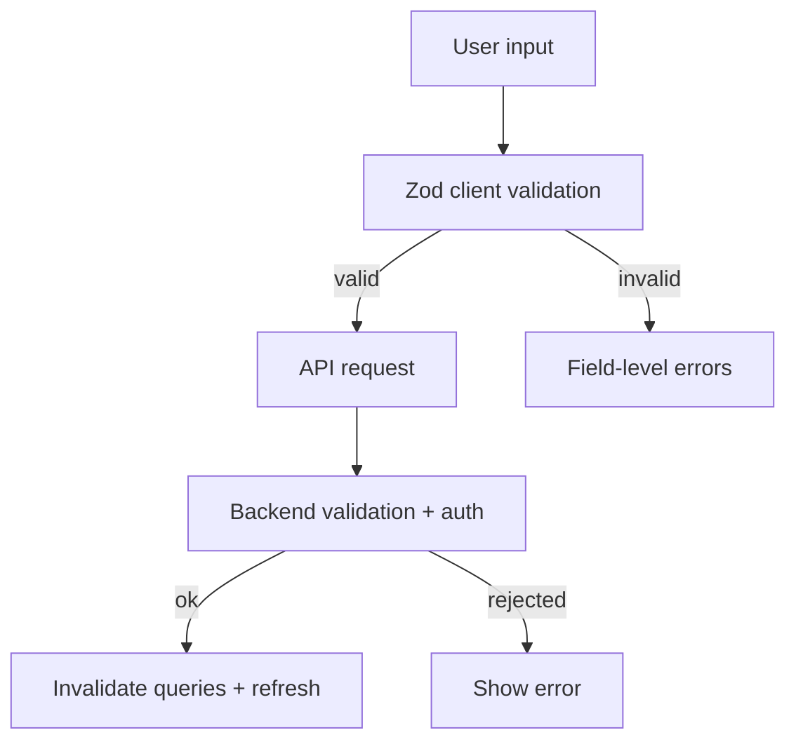

[⬅️ Back to Suppliers Domain](./index.md)

- [Back to Overview (English)](../../overview.md)
- [Zurück zum Überblick (Deutsch)](../../overview-de.md)

# Suppliers Validation & Authorization

Suppliers uses Zod schemas for client-side validation and relies on the backend as the source of truth for authorization and final business rules.

## Validation schemas

Location: `frontend/src/api/suppliers/validation.ts`

### Create supplier (`createSupplierSchema`)

- `name`: required, trimmed
- `contactName`: optional → stored as `null` when empty
- `phone`: optional → stored as `null` when empty
- `email`: optional, validated as email when provided → stored as `null` when empty

### Edit supplier (`editSupplierSchema`)

- `supplierId`: required
- contact fields are nullable
- supplier name is not part of the schema (treated as immutable)

## Server-side rules and tolerant client behavior

Supplier list fetching is designed to be resilient:
- the list fetcher tolerates multiple response envelope shapes
- on network errors it returns an empty page rather than throwing

This keeps the Suppliers board rendering even under partial backend failures.

## Authorization notes

The UI and dialog code documents restricted operations:

- Delete supplier: ADMIN-only
  - enforced client-side in `useDeleteSupplierForm` (blocks the request)
  - enforced server-side (source of truth)

- Edit supplier: documented as ADMIN-only
  - the UI may allow opening the dialog based on selection
  - final authorization is backend-owned; client shows user-friendly errors

Demo mode behavior:
- Unlike the Inventory domain, Suppliers does not currently implement explicit `readOnly` dialog props.
- If demo sessions are intended to be read-only, enforcement is expected to be handled by backend authorization (and/or could be added later at the dialog level).

## Conceptual model

---

[Back to top](#top)
