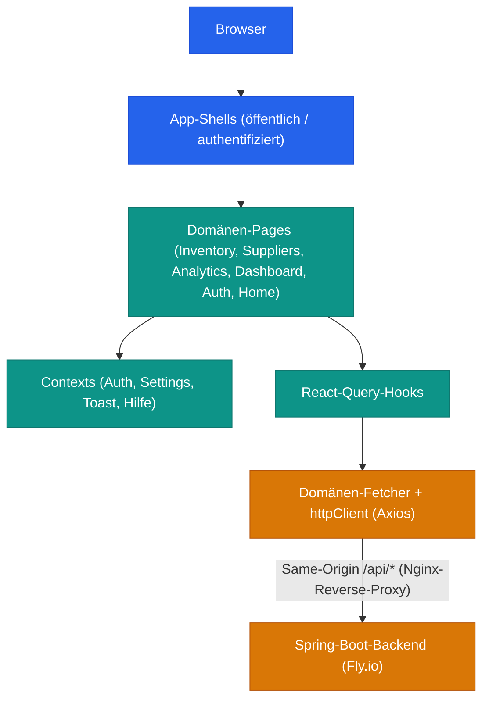

# Frontend-Architektur

Das Frontend von Smart Supply Pro ist eine React-+-TypeScript-Single-Page-Anwendung
für Bestandsverwaltung, Lieferanten-Workflows und Einkaufsanalysen. Die Architektur
priorisiert eine **vorhersehbare Domänenstruktur**, **typisierten Datenzugriff**
und ein **zweisprachiges Nutzererlebnis mit Deutsch als Erstsprache**.

> **Dies ist eine einseitige Zusammenfassung.** Die strukturierte arc42-Dokumentation —
> Einführung und Ziele, Randbedingungen, Kontext, Bausteine, Laufzeit, Verteilung,
> Konzepte, Entscheidungen, Qualität, Risiken und Glossar — finden Sie in der
> [vollständigen Architekturdokumentation](index.html).

## Technologie-Stack

| Komponente     | Technologie                   | Version |
|----------------|-------------------------------|---------|
| Framework      | React                         | 19.1    |
| Sprache        | TypeScript                    | 6.x     |
| Build-Tool     | Vite                          | 7.x     |
| UI-Bibliothek  | MUI (Material UI) + X DataGrid| 7.x / 8.x |
| Server-State   | TanStack React Query          | 5.x     |
| Routing        | React Router                  | 7.x     |
| Forms          | React Hook Form + Zod         | 7.x / 4.x |
| i18n           | i18next + react-i18next       | 25.x / 15.x |
| Diagramme      | Recharts                      | 3.x     |
| HTTP-Client    | Axios                         | 1.x     |
| Tests          | Vitest + Testing Library      | 4.x     |
| Laufzeit       | Node                          | >= 24   |

## Zentrale Architekturprinzipien

1. **Feature-First-Struktur** — ein eigenständiges Modul pro Geschäftsdomäne unter `src/pages/`
2. **Strikte Importrichtung** — Pages berühren keine HTTP-Details; die API-Schicht importiert keine UI
3. **Ein HTTP-Client** — eine einzige Axios-Instanz verantwortet Credentials, Header, Timeouts und die zentrale 401-Behandlung
4. **Server-State über React Query** — Caching, Retries und Invalidierung liegen in Query-Hooks, nicht in Komponenten
5. **Context für globalen Client-State** — Auth, Settings, Toast und Hilfe, Zugriff über Hooks, die außerhalb ihres Providers werfen
6. **German-First-i18n** — localStorage wird beim Erstbesuch mit `de` vorbelegt; keine Fallback-Strings im Code
7. **Dialoggetriebene Mutationen** — Create-/Edit-/Delete-Flows sind isolierte Dialog-Container je Domäne
8. **Testbarkeit** — 1.319 Vitest-Tests in 225 Dateien (~86 % Zeilenabdeckung) über Unit-, Komponenten- und Routing-Contract-Ebenen

## Systemarchitektur



## Domänen

Jeder Geschäftsbereich ist ein eigenständiges Modul mit derselben Orchestrator-Form:
eine Board-Komponente komponiert State-Hooks, Handler-Hooks, Query-Hooks,
Präsentationskomponenten und Dialog-Container.

| Domäne | Verantwortung |
|---|---|
| Inventory | Artikel-CRUD, Mengenanpassung, Preisänderungen, Bestandsgründe |
| Suppliers | Lieferanten-CRUD, Such-/Anzeigemodi, Löschsperre bei aktivem Bestand |
| Analytics | Chart-/Tabellenblöcke, Filter mit URL-Sync, lieferantenabhängige Abfragen |
| Dashboard | KPI-Karten, Bewegungs-Mini-Chart, Navigationszentrale |
| Auth | Login, OAuth-Callback + Session-Hydration, Demo-Einstieg, Logout |
| Home | Öffentlicher Landing-Flow und Demo-Einstiegspunkt |

## Authentifizierung und Session-Modell

Sessionbasiertes OAuth2 (Google), vollständig im Backend — die SPA hält keine
Tokens. Der Auth-Context hydratisiert über `GET /api/me`; ein schreibgeschützter
**Demo-Modus** existiert ausschließlich im Frontend über localStorage, Schreiboperationen
sind in der UI blockiert. Unautorisierte Antworten behandelt der Axios-Interceptor
zentral, mit drei Ausnahmen (öffentliche Seiten, der `/api/me`-Probe-Aufruf,
Demo-Sessions).

## Internationalisierung

Vollständige Lokalisierung Englisch/Deutsch mit zur Laufzeit geladenen JSON-Namespaces,
zur Compile-Zeit typisierten Schlüsseln (`resources.d.ts`) und einer strikten Richtlinie
ohne Fallback-Strings: Jeder Schlüssel existiert in beiden Sprachdateien. Der Erstbesuch
rendert bewusst auf Deutsch.

## Deployment

Der Produktions-Build wird von **Nginx auf Koyeb** ausgeliefert. Der Browser-Traffic
ist **Same-Origin**: Nginx schreibt die eingebrannte API-Basis zur Auslieferungszeit
auf den Frontend-Host um und reverse-proxyt `/api/*` sowie die OAuth-Pfade zum
Backend auf Fly.io (kanonische Aufzeichnung: Backend-ADR-0008).

```
Source push
  → 5-frontend-ci.yml       type-check, lint, Vitest suite
  → 6-deploy-frontend.yml   Docker build (Nginx), deploy to Koyeb
```

## Tests

- **Unit-Tests** — Hooks, Utilities, API-Fetcher und Client-Policies
- **Komponententests** — Testing-Library-Rendering mit i18n- und Provider-Harness
- **Routing-Contract-Tests** — Guard-Verhalten, Redirects und Routenoberfläche

Abdeckung und Taxonomie-Konventionen sind dokumentiert in
[§8c Testing Concepts](08c-concepts-testing.md) und
[ADR-0008](09-decisions/adr-0008-testing-structure-and-taxonomy.md).
