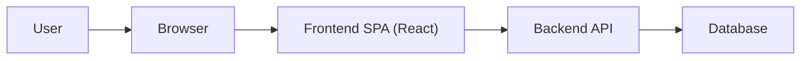

[⬅️ Back to Architecture Index](./index.md)

# Frontend Architecture Overview

## Introduction

Smart Supply Pro’s frontend is a React single-page application (SPA) that provides the user experience for inventory management, supplier workflows, and analytics. The architecture documentation focuses on **clarity**, **consistency**, and **maintainability** by describing how the application is organized into topics (routing, state, data access, UI, etc.) and how those topics fit together.

> For diagrams and visual references, start at **[Architectural Diagrams](./diagrams/)**.

## System Context (high-level)

## Documentation Scope

This overview intentionally avoids implementation details. Each topic below links to its dedicated section where patterns, decisions, and examples will be documented.

## Topics (and where to find diagrams)

Each topic links to:
- the **topic documentation folder**, and
- the **diagrams entry point** (centralized under `./diagrams/`).

### App Shell
- Docs: [App Shell](./app-shell/index.md)
- Diagrams: [Architectural Diagrams](./diagrams/)
- Description: Entry point for shell variants (public vs authenticated), layout composition, preference handling (theme/locale), toasts, settings entry points, and help integration

### Routing
- Docs: [Routing](./routing/)
- Diagrams: [Architectural Diagrams](./diagrams/)
- Description: to be implemented

### State
- Docs: [State](./state/)
- Diagrams: [Architectural Diagrams](./diagrams/)
- Description: to be implemented

### Data Access
- Docs: [Data Access](./data-access/)
- Diagrams: [Architectural Diagrams](./diagrams/)
- Description: to be implemented

### Domains
- Docs: [Domains](./domains/)
- Diagrams: [Architectural Diagrams](./diagrams/)
- Description: to be implemented

### UI Components
- Docs: [UI Components](./ui/)
- Diagrams: [Architectural Diagrams](./diagrams/)
- Description: to be implemented

### Theming
- Docs: [Theming](./theming/)
- Diagrams: [Architectural Diagrams](./diagrams/)
- Description: to be implemented

### Internationalization (i18n)
- Docs: [i18n](./i18n/)
- Diagrams: [Architectural Diagrams](./diagrams/)
- Description: to be implemented

### Performance
- Docs: [Performance](./performance/)
- Diagrams: [Architectural Diagrams](./diagrams/)
- Description: to be implemented

### Testing
- Docs: [Testing](./testing/)
- Diagrams: [Architectural Diagrams](./diagrams/)
- Description: to be implemented

### Architectural Decision Records (ADRs)
- Docs: [ADRs](./adr/)
- Diagrams: [Architectural Diagrams](./diagrams/)
- Description: to be implemented

## Next Steps

1. Read the topic that matches your current task (routing/state/data-access/ui).
2. Use [Architectural Diagrams](./diagrams/) as the single entry point for visuals.
3. Update each topic’s short description as the documentation evolves.

---

[⬅️ Back to Architecture Index](./index.md)
