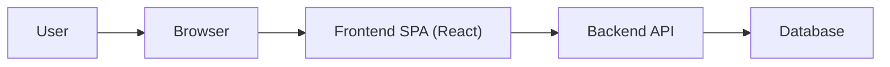

[⬅️ Back to Architecture Index](./index.md)

# Frontend Architecture Overview

## Introduction

Smart Supply Pro’s frontend is a React single-page application (SPA) that provides the user experience for inventory management, supplier workflows, and analytics. The architecture documentation focuses on **clarity**, **consistency**, and **maintainability** by describing how the application is organized into topics (routing, state, data access, UI, etc.) and how those topics fit together.

> For diagrams and visual references, start at **[Architectural Diagrams](./diagrams/index.md)**.

## System Context (high-level)

```mermaid
graph LR
    User["User"] --> Browser["Browser"]
    Browser --> SPA["Frontend SPA (React)"]
    SPA --> API["Backend API"]
    API --> DB["Database"]
```

## Documentation Scope

This overview intentionally avoids implementation details. Each topic below links to its dedicated section where patterns, decisions, and examples will be documented.

## Topics (and where to find diagrams)

Each topic links to:
- the **topic documentation folder**, and
- the **diagrams entry point** (centralized under `./diagrams/index.md`).

### App Shell
- Docs: [App Shell](./app-shell/index.md)
- Diagrams: [Architectural Diagrams](./diagrams/index.md)
- Description: Entry point for shell variants (public vs authenticated), layout composition, preference handling (theme/locale), toasts, settings entry points, and help integration

### Routing
- Docs: [Routing](./routing/index.md)
- Diagrams: [Architectural Diagrams](./diagrams/index.md)
- Description: How URLs map to pages, how routes are grouped (public vs authenticated), guard/redirect behavior, logout/session-expiry navigation, and 404 fallback

### State
- Docs: [State](./state/index.md)
- Diagrams: [Architectural Diagrams](./diagrams/index.md)
- Description: Global cross-cutting state via React Context (auth, settings, toast, help) and the boundaries vs local UI state and server state

### Data Access
- Docs: [Data Access](./data-access/index.md)
- Diagrams: [Architectural Diagrams](./diagrams/index.md)
- Description: API layer structure (Axios client, domain fetchers/normalizers, React Query hooks), caching conventions, envelope tolerance, and user-friendly error handling

### Domains
- Docs: [Domains](./domains/index.md)
- Diagrams: [Architectural Diagrams](./diagrams/index.md)
- Description: How domain pages are organized under src/pages/* (Inventory, Suppliers, Analytics, etc.), and what each page orchestrator owns vs shared layers

### UI Components
- Docs: [UI & UX Building Blocks](./ui/index.md)
- Diagrams: [Architectural Diagrams](./diagrams/index.md)
- Description: Shared UI building blocks (e.g. `StatCard`), shared hooks (`createContextHook`, debounce), help topics + trigger button, and the health-check polling hook

### Theming
- Docs: [Theme & Styling](./theming/index.md)
- Diagrams: [Architectural Diagrams](./diagrams/index.md)
- Description: MUI theme factory (`buildTheme`), locale packs (Material + DataGrid), compact density defaults, and the small set of global CSS helpers

### Internationalization (i18n)
- Docs: [Internationalization (i18n)](./i18n/index.md)
- Diagrams: [Architectural Diagrams](./diagrams/index.md)
- Description: i18next setup (German-first), namespace JSON structure under `public/locales/*`, key typing via `resources.d.ts`, and help-content localization conventions

### Performance
- Docs: [Performance](./performance/)
- Diagrams: [Architectural Diagrams](./diagrams/index.md)
- Description: to be implemented

### Testing
- Docs: [Testing](./testing/)
- Diagrams: [Architectural Diagrams](./diagrams/index.md)
- Description: to be implemented

### Architectural Decision Records (ADRs)
- Docs: [ADRs](./adr/index.md)
- Diagrams: [Architectural Diagrams](./diagrams/index.md)
- Description: “Why” decisions for key architectural choices (folder strategy, API abstraction, page model, dialog workflows, shell split, context-based global state, i18n integration, and testing taxonomy)

## Next Steps

1. Read the topic that matches your current task (routing/state/data-access/ui).
2. Use [Architectural Diagrams](./diagrams/index.md) as the single entry point for visuals.
3. Update each topic’s short description as the documentation evolves.

---

[⬅️ Back to Architecture Index](./index.md)
