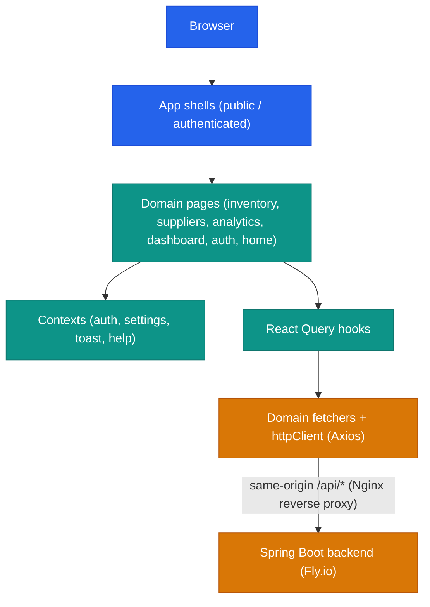

# Frontend Architecture

Smart Supply Pro's frontend is a React + TypeScript single-page application for
inventory management, supplier workflows, and purchasing analytics. The
architecture prioritises **predictable domain structure**, **typed data access**,
and **a German-first bilingual user experience**.

> **This is a one-page summary.** For the structured arc42 documentation —
> introduction and goals, constraints, context, building blocks, runtime,
> deployment, concepts, decisions, quality, risks, and glossary — see the
> [full architecture documentation](index.html).

## Technology stack

| Component      | Technology                    | Version |
|----------------|-------------------------------|---------|
| Framework      | React                         | 19.1    |
| Language       | TypeScript                    | 6.x     |
| Build tool     | Vite                          | 7.x     |
| UI library     | MUI (Material UI) + X DataGrid| 7.x / 8.x |
| Server state   | TanStack React Query          | 5.x     |
| Routing        | React Router                  | 7.x     |
| Forms          | React Hook Form + Zod         | 7.x / 4.x |
| i18n           | i18next + react-i18next       | 25.x / 15.x |
| Charts         | Recharts                      | 3.x     |
| HTTP client    | Axios                         | 1.x     |
| Testing        | Vitest + Testing Library      | 4.x     |
| Runtime        | Node                          | >= 24   |

## Key architectural principles

1. **Feature-first structure** — one self-contained module per business domain under `src/pages/`
2. **Strict import direction** — pages never touch HTTP details; the API layer never imports UI
3. **One HTTP client** — a single Axios instance owns credentials, headers, timeouts, and central 401 handling
4. **Server state via React Query** — caching, retries, and invalidation live in query hooks, not components
5. **Context for global client state** — auth, settings, toast, and help, accessed through throwing hooks
6. **German-first i18n** — localStorage pre-seeded to `de` on first visit; no fallback strings in code
7. **Dialog-driven mutations** — create/edit/delete flows are isolated dialog containers per domain
8. **Testability** — ~1,600 Vitest tests across 251 files (~99% line coverage) spanning unit, component, and routing-contract layers

## System architecture


```mermaid
flowchart TB
  User["Browser"]:::controller
  Shell["App shells (public / authenticated)"]:::controller
  Pages["Domain pages (inventory, suppliers, analytics, dashboard, auth, home)"]:::service
  State["Contexts (auth, settings, toast, help)"]:::service
  Query["React Query hooks"]:::service
  API["Domain fetchers + httpClient (Axios)"]:::repository
  Backend["Spring Boot backend (Fly.io)"]:::repository

  User --> Shell
  Shell --> Pages
  Pages --> State
  Pages --> Query
  Query --> API
  API -->|"same-origin /api/* (Nginx reverse proxy)"| Backend

  classDef controller fill:#2563eb,color:#fff,stroke:#1d4ed8;
  classDef service    fill:#0d9488,color:#fff,stroke:#0f766e;
  classDef repository fill:#d97706,color:#fff,stroke:#b45309;
```

## Domains

Each business area is a self-contained module with the same orchestrator shape:
a board component composing state hooks, handler hooks, query hooks,
presentational components, and dialog containers.

| Domain | Responsibility |
|---|---|
| Inventory | Item CRUD, quantity adjustment, price changes, stock reasons |
| Suppliers | Supplier CRUD, search/display modes, active-stock delete guard |
| Analytics | Chart/table blocks, filters with URL sync, supplier-gated queries |
| Dashboard | KPI cards, movement mini-chart, navigation hub |
| Auth | Login, OAuth callback + session hydration, demo entry, logout |
| Home | Public landing flow and demo entry point |

## Authentication and session model

Session-based OAuth2 (Google) handled by the backend — the SPA holds no tokens.
The auth context hydrates from `GET /api/me`; a read-only **demo mode** exists
entirely in the frontend via localStorage, with write operations blocked in the
UI. Unauthorized responses are handled centrally by the Axios interceptor, with
three exemptions (public pages, the `/api/me` probe, demo sessions).

## Internationalization

Full English/German localization with runtime-loaded JSON namespaces, compile-time
typed keys (`resources.d.ts`), and a strict no-fallback-strings policy: every key
exists in both locale files. First visit renders German by design.

## Deployment

The production build is served by **Nginx on Koyeb**. Browser traffic is
**same-origin**: Nginx rewrites the baked API base to the frontend host at serve
time and reverse-proxies `/api/*` and the OAuth paths to the backend on Fly.io
(canonical record: backend ADR-0008).

```
Source push
  → 5-frontend-ci.yml       type-check, lint, Vitest suite
  → 6-deploy-frontend.yml   Docker build (Nginx), deploy to Koyeb
```

## Testing

- **Unit tests** — hooks, utilities, API fetchers, and client policies
- **Component tests** — Testing Library rendering with i18n + provider harnesses
- **Routing-contract tests** — guard behavior, redirects, and route surface

Coverage and taxonomy conventions are documented in
[§8c Testing Concepts](08c-concepts-testing.md) and
[ADR-0008](09-decisions/adr-0008-testing-structure-and-taxonomy.md).
