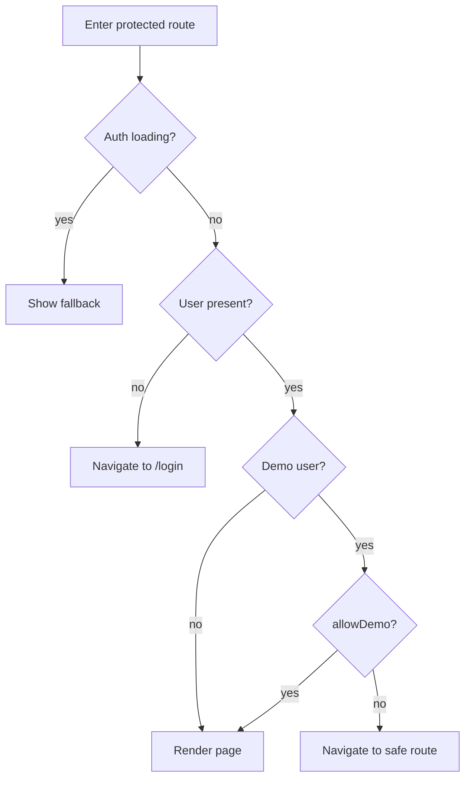

[⬅️ Back to Routing Index](./index.md)

- [Back to Overview (English)](../overview.md)
- [Zurück zum Überblick (Deutsch)](../overview-de.md)

# Guards & Redirects (RequireAuth)

Protected routes are gated by a dedicated route guard to ensure consistent redirect behavior and to avoid UI flicker during auth bootstrap.

## Responsibilities of the guard

- While authentication state is being determined: render a small loading fallback.
- If the user is not authenticated: redirect to `/login`.
- If the session is in a transition state (logout in progress): hold the UI to avoid flashing the login page.
- If the user is a demo user: allow or deny access depending on the route’s policy.

## Conceptual decision flow

## Boundaries

Included:
- High-level redirect rules and guard responsibilities

Excluded:
- Authentication implementation details (how `useAuth` works internally)
- Backend session/cookie semantics

---

[Back to top](#top)
