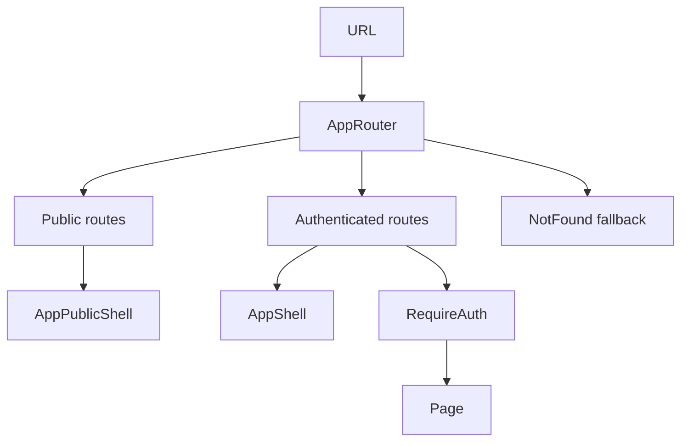

[⬅️ Back to Frontend Architecture Index](../index.md)

- [Back to Overview (English)](../overview.md)
- [Zurück zum Überblick (Deutsch)](../overview-de.md)

# Routing

## 1️⃣ Section Purpose

This section documents the frontend **routing architecture**: how URLs map to pages, how the application separates **public** vs. **authenticated** route groups, and how cross-cutting navigation behavior (guards, redirects, session handling, and 404 fallbacks) is designed.

It exists to keep navigation predictable and safe: users should always end up in the correct shell, protected pages must be gated, and logout/session-expiry must be handled consistently.

The design decisions captured here include: route grouping by shell, the use of a dedicated route guard, a deliberate public logout route to avoid race conditions, and a single global 404 fallback.

## 2️⃣ Scope & Boundaries

Included:
- Route grouping (public vs. authenticated)
- URL-to-page mapping and key route parameters
- Authorization gating and redirect behavior
- Logout/session-expiry navigation flow

- Global loading (auth bootstrap) and 404 fallback behavior
- Routing-related contract tests

Excluded:
- UI chrome (header/sidebar layout) (documented under [App Shell](../app-shell/index.md))
- Data-fetching and API error strategies (documented under [Data Access](../data-access/index.md))
- Domain page content and feature design (documented under [Domains](../domains/index.md))

## 3️⃣ High-Level Diagram

## 4️⃣ Section Map (Links to nested docs)

## Contents

- [Route Groups (Public vs Authenticated)](route-groups.md) - How public and authenticated routes are separated and why `/logout` is handled as a public route
- [Route Map (Paths + Parameters)](route-map.md) - High-level list of supported paths and the small set of URL parameters
- [Guards & Redirects (RequireAuth)](guards-and-redirects.md) - Guard responsibilities, redirect rules, and demo-policy gating (conceptually)
- [Logout & Session Expiry Navigation](logout-and-session-expiry.md) - Why session expiry navigates to a dedicated `/logout` route and how logout converges across tabs
- [Loading & 404 Behavior](loading-and-404.md) - Global auth-bootstrap loading screen and the single catch-all Not Found fallback
- [Routing Contract Tests](routing-contract-tests.md) - The routing invariants protected by contract-style tests

## Related ADRs

- [ADR-0005: Application shell split (authenticated vs public)](../adr/adr-0005-shell-split-authenticated-vs-public.md)
- [ADR-0001: Frontend folder structure strategy](../adr/adr-0001-frontend-folder-structure-strategy.md)

---

[⬅️ Back to Frontend Architecture Index](../index.md)
