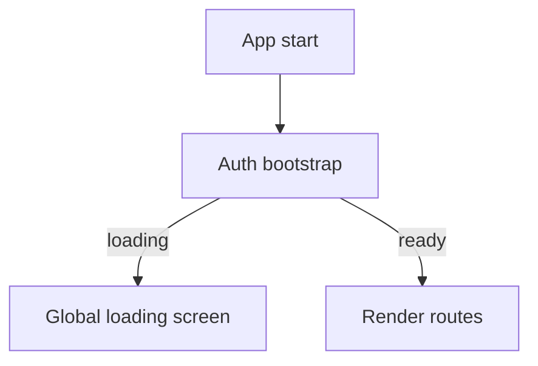
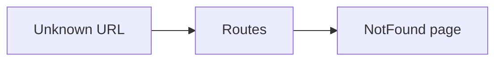

[⬅️ Back to Routing Index](./index.md)

- [Back to Overview (English)](../overview.md)
- [Zurück zum Überblick (Deutsch)](../overview-de.md)

# Loading & 404 Behavior

This page documents the two key global behaviors that keep navigation stable:

- a global loading screen during initial auth bootstrap
- a single 404 fallback route for unknown paths

## Global loading (auth bootstrap)

Before rendering routes, the app may temporarily render a centered progress indicator while authentication state is resolving. This prevents guard flicker and reduces confusing transitions.

## 404 fallback

Unknown paths are handled by a single catch-all route that renders a dedicated Not Found page.

## Boundaries

Included:
- Global loading behavior (routing-level)
- 404 fallback as a single, global safety net

Excluded:
- Page-level empty states (e.g., “no items yet”) (documented with the feature)

---

[Back to top](#top)
