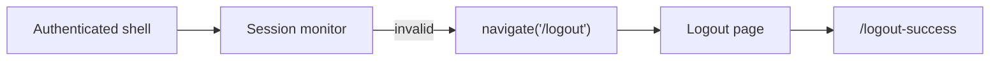

[⬅️ Back to Routing Index](./index.md)

- [Back to Overview (English)](../overview.md)
- [Zurück zum Überblick (Deutsch)](../overview-de.md)

# Logout & Session Expiry Navigation

The routing layer is used as the central mechanism for consistent logout handling. Instead of throwing UI errors on session expiry, the app **navigates to a dedicated logout route**.

## Why a dedicated logout route?

- Ensures cleanup and user messaging happen in one place.
- Makes session expiry handling consistent across pages.
- Avoids duplicated logout logic in leaf components.

## Session expiry detection (conceptual)

A session management hook detects invalid/expired sessions (e.g., via periodic “heartbeat” checks) and triggers navigation.

## Cross-tab logout (conceptual)

Logout events can be broadcast using browser storage events so all open tabs converge to the same logout flow.

## Boundaries

Included:
- Routing-level approach: navigate to `/logout` on invalid session
- Why `/logout` is treated as a public route

Excluded:
- Full auth lifecycle and token/cookie details
- Backend logout mechanics

---

[Back to top](#top)
