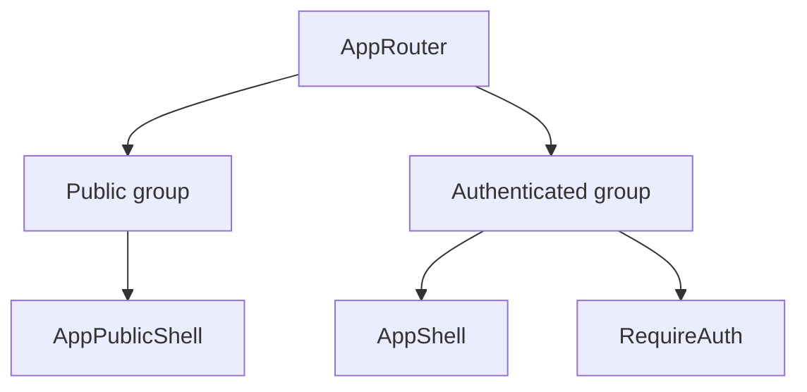

[⬅️ Back to Routing Index](./index.md)

- [Back to Overview (English)](../overview.md)
- [Zurück zum Überblick (Deutsch)](../overview-de.md)

# Route Groups (Public vs Authenticated)

Routing is organized into two primary route groups to keep user experience and security concerns clear: **public routes** and **authenticated routes**.

## Public routes

Public routes are accessible without an authenticated user session. They render under the **public shell** to keep the UI minimal and appropriate for unauthenticated contexts.

Typical examples include:
- landing/home
- login
- OAuth callback
- logout success

## Authenticated routes

Authenticated routes require a valid user session and render inside the **application shell** (full chrome). Each route is additionally protected by a route guard.

Typical examples include:
- dashboard
- inventory
- suppliers
- analytics

## Why group routes by shell?

- Public pages should not inherit authenticated navigation chrome.
- Authenticated pages require consistent layout and global actions.
- It reduces accidental coupling (e.g., pages relying on sidebar state).

## Conceptual mapping

## Important note: public logout route

The application intentionally treats `/logout` as a **public** route. This avoids guard “race” scenarios during cleanup and makes logout behavior stable even when auth state is transitioning.

---

[Back to top](#top)
