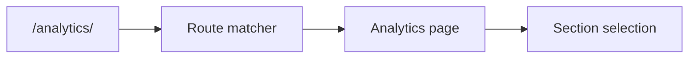

[⬅️ Back to Routing Index](./index.md)

- [Back to Overview (English)](../overview.md)
- [Zurück zum Überblick (Deutsch)](../overview-de.md)

# Route Map (Paths + Parameters)

This page provides a high-level route map: which **paths** exist, which are public vs. authenticated, and what parameters (if any) are part of the URL.

## Public routes (high-level)

- `/` (home)
- `/login`
- `/auth` (OAuth callback)
- `/logout-success`
- `/logout` (logout flow; public by design)

## Authenticated routes (high-level)

- `/dashboard`
- `/inventory`
- `/suppliers`
- `/analytics/:section?` (optional `section` parameter)

## Optional parameters

Some routes allow optional URL segments to support deep links into sub-sections without creating a large number of separate top-level paths.

## Boundaries

Included:
- What the route surface area is (paths and optional params)

Excluded:
- Page-level internal navigation (tabs, sub-routes) unless it is URL-backed
- Route generation helpers and link-building conventions (documented as the section expands)

---

[Back to top](#top)
