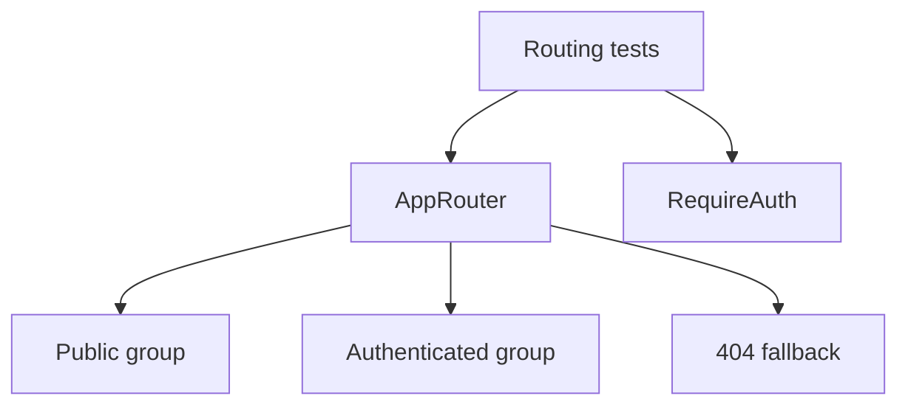

[⬅️ Back to Routing Index](./index.md)

- [Back to Overview (English)](../overview.md)
- [Zurück zum Überblick (Deutsch)](../overview-de.md)

# Routing Contract Tests

Routing is covered by contract-style tests to ensure that core navigation invariants remain stable as the UI evolves.

## What these tests protect

- Public routes render under the public shell.
- Authenticated routes render under the application shell and are guarded.
- Unknown routes fall back to the Not Found page.
- The guard redirects correctly for unauthenticated and demo scenarios.

## Conceptual test scope

## Boundaries

Included:
- Behavioral contracts (rendering under correct shells, redirect outcomes)

Excluded:
- Full React Router internal correctness (assumed library behavior)
- End-to-end browser navigation (covered elsewhere if needed)

---

[Back to top](#top)
