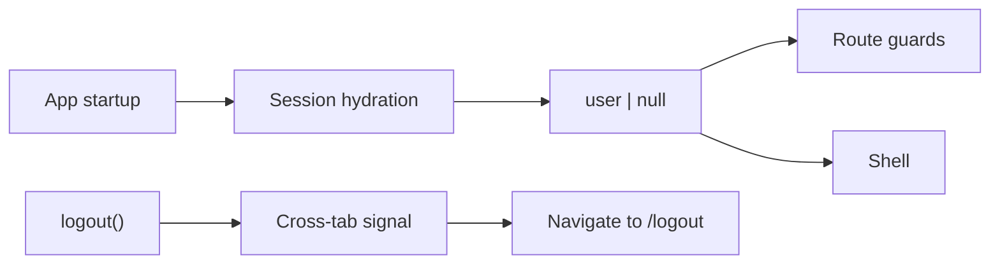

[⬅️ Back to State Index](./index.md)

- [Back to Overview (English)](../overview.md)
- [Zurück zum Überblick (Deutsch)](../overview-de.md)

# Auth Context

The Auth Context provides a single source of truth for **authentication state** across the frontend.

## Responsibilities (high-level)

- Hydrate session state at startup (determine whether a user is authenticated).
- Expose the current user to the rest of the app.
- Expose login entry points (e.g., OAuth redirect) and a client-only demo session.
- Provide a logout signal for the UI to converge on a consistent logout flow.

## Demo mode

The architecture supports a demo user session that can be established client-side for read-only exploration. Demo mode is also reflected in routing policy (some routes allow demo access).

## Cross-tab behavior

Logout can be broadcast across tabs so that multiple open tabs converge to the same logged-out state.

## Conceptual flow

## Non-goals (by design)

- Performing the full backend logout HTTP flow directly inside the context.
- Owning routing decisions: consumers (guards/shells) navigate as needed.

---

[Back to top](#top)
