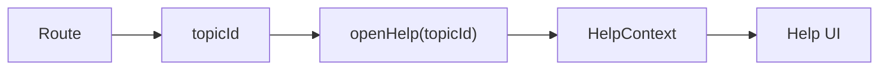

[⬅️ Back to State Index](./index.md)

- [Back to Overview (English)](../overview.md)
- [Zurück zum Überblick (Deutsch)](../overview-de.md)

# Help Context

The Help Context provides global state for a context-sensitive help experience.

## Responsibilities (high-level)

- Track whether help UI is open or closed.
- Track the currently selected help topic.
- Provide an API to open help for a specific topic and to close help.
- Support basic UX behavior like closing on Escape.

## Conceptual model

## Boundaries

Included:
- Help panel state management (open/close + topic)

Excluded:
- Help content authoring/storage/rendering details (documented in the Help area)

---

[Back to top](#top)
