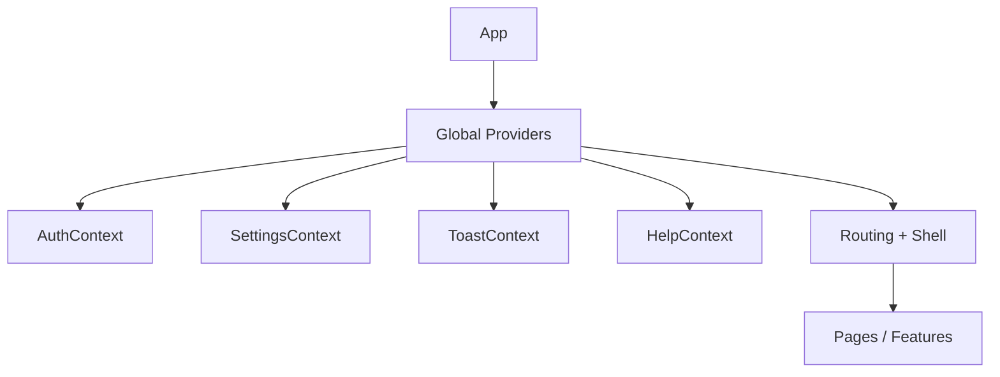

[⬅️ Back to Frontend Architecture Index](../index.md)

- [Back to Overview (English)](../overview.md)
- [Zurück zum Überblick (Deutsch)](../overview-de.md)

# State Management

## 1️⃣ Section Purpose

This section documents the **global and cross-cutting state mechanisms** used in the Smart Supply Pro frontend.

It exists to clarify which concerns are treated as *application-wide state* (authentication, user preferences, help panel state, toast notifications) and why those concerns are centralized.

The design decisions captured here cover: when to use React Context vs. local component state, how state is composed at the app root, and the boundaries between “global UI state” and “feature/domain state”.

## 2️⃣ Scope & Boundaries

Included:
- React Context providers for cross-cutting concerns:
  - Authentication
  - Settings / user preferences
  - Toast notifications
  - Help panel state
- Provider composition and ownership boundaries (who owns what state)
- Architectural rules of thumb for global vs. local state

Excluded:
- Server-state caching and API data lifecycle (documented under [Data Access](../data-access/index.md))
- Page/feature internal state and component state
- Form state and validation rules (documented under [UI Components](../ui/))

## 3️⃣ High-Level Diagram

## 4️⃣ Section Map (Links to nested docs)

## Contents

- [State Landscape (Global vs Local vs Server-state)](state-landscape.md) - What belongs in global context and what should not
- [Provider Composition (Where Providers Live)](provider-composition.md) - How contexts are layered and why composition matters
- [Auth Context](auth-context.md) - Single source of truth for the current user/session and demo mode
- [Settings Context](settings-context.md) - User preferences + system info with persistence and graceful fallbacks
- [Toast Context](toast-context.md) - Ultra-light toast API exposed by shells for ephemeral notifications
- [Help Context](help-context.md) - Global help panel state: open/close + active topic

---

[⬅️ Back to Frontend Architecture Index](../index.md)
