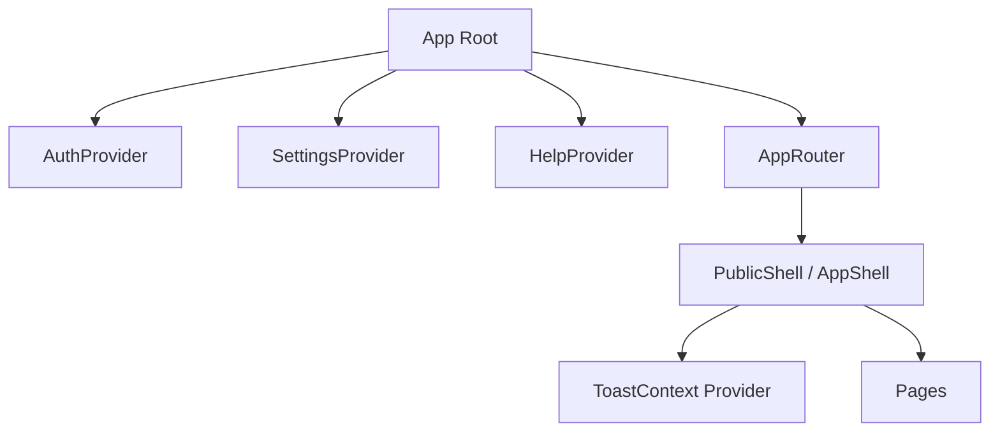

[⬅️ Back to State Index](./index.md)

- [Back to Overview (English)](../overview.md)
- [Zurück zum Überblick (Deutsch)](../overview-de.md)

# Provider Composition (Where Providers Live)

This document describes the *architectural placement* of global providers and why composition matters.

## Why composition is important

- Providers define **who can access which global state**.
- Provider ordering can influence behavior (e.g., preferences affecting i18n/theme).
- Keeping providers near the app root makes global behavior consistent and testable.

## Where providers are used

Conceptually:
- App-level providers wrap routing and shells so that all pages can access shared concerns.
- Some providers are also hosted by shells (e.g., toast API) to keep UI feedback consistent across public/auth variants.

## Conceptual layering

## Boundaries

Included:
- The “why” of provider placement
- The distinction between global app providers vs. shell-provided cross-cutting UI capabilities

Excluded:
- Exact file-level bootstrap wiring (documented as needed when the docs expand)

---

[Back to top](#top)
