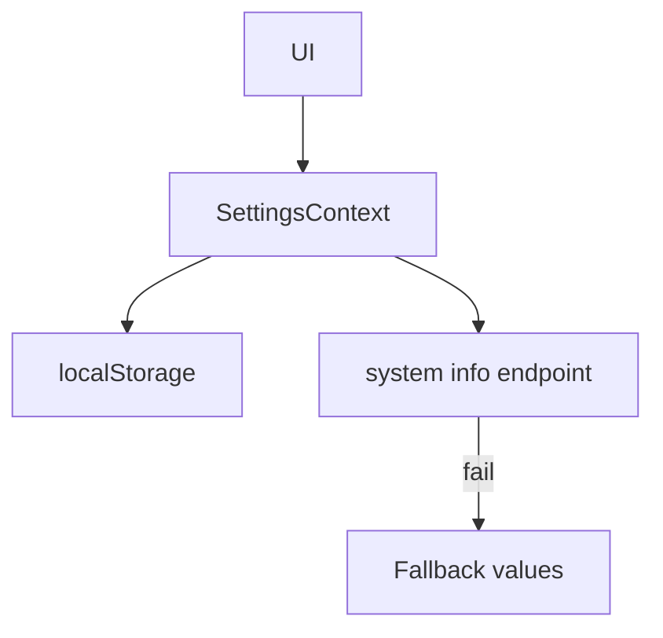

[⬅️ Back to State Index](./index.md)

- [Back to Overview (English)](../overview.md)
- [Zurück zum Überblick (Deutsch)](../overview-de.md)

# Settings Context

The Settings Context centralizes **application-wide user preferences** and **system information** used across UI surfaces.

## Responsibilities (high-level)

- Provide user preferences (e.g., date/number formatting, density) to the app.
- Persist preferences to browser storage so they survive refresh.
- Synchronize some defaults with the active UI language.
- Fetch system info from the backend, with graceful fallback values if the backend is unavailable.

## Why this is global

These settings influence multiple parts of the experience:
- formatting and display preferences
- system metadata display
- consistent defaults when the language changes

## Persistence and resilience (conceptual)

## Boundaries

Included:
- Preference ownership + persistence at a global layer
- System info exposure as shared UI metadata

Excluded:
- Domain-specific configuration screens (documented under [Domains](../domains/index.md))
- Theming tokens and UI component styling (documented under [Theming](../theming/) and [UI Components](../ui/))

---

[Back to top](#top)
