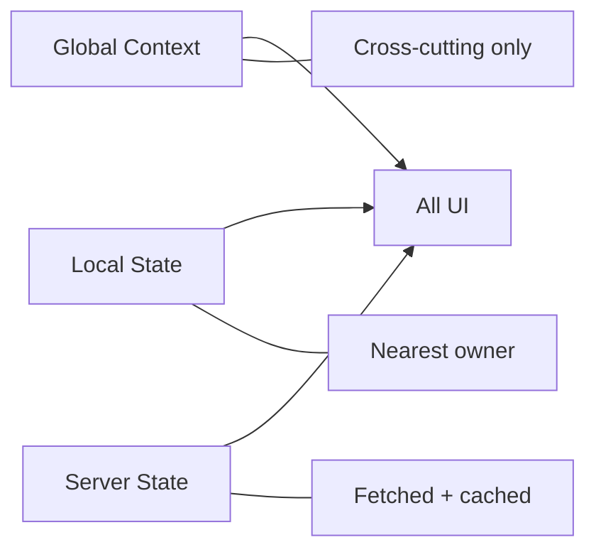

[⬅️ Back to State Index](./index.md)

- [Back to Overview (English)](../overview.md)
- [Zurück zum Überblick (Deutsch)](../overview-de.md)

# State Landscape (Global vs Local vs Server-state)

The frontend intentionally distinguishes between three kinds of state:

1. **Global cross-cutting state** (React Context)
2. **Local UI state** (component state / hooks)
3. **Server state** (data fetched from the backend)

This separation keeps the application maintainable by preventing “global state sprawl”.

## 1) Global cross-cutting state

Global state is used when multiple, unrelated parts of the UI need shared access to a concern that is not specific to one page.

Examples in this codebase:
- authentication session / current user
- user preferences (formatting, density)
- help panel open/close + current topic
- toast notification API

## 2) Local UI state

Local state belongs inside the component tree where it is used. This includes UI-only concerns like:
- dialog open/close state inside a feature
- tab selections that do not need to be shared globally
- temporary form input state

## 3) Server state

Backend data is treated as server state and should be managed via the data-access layer (not via React Context) to enable caching, retries, background refresh, and consistent error handling.

## Conceptual model

## Architectural rule of thumb

- If it’s **cross-cutting**, consider a context provider.
- If it’s **page-local**, keep it local.
- If it’s **backend-derived**, treat it as server state.

---

[Back to top](#top)
