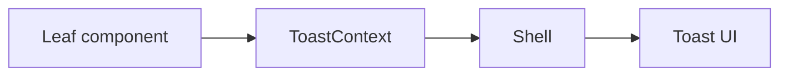

[⬅️ Back to State Index](./index.md)

- [Back to Overview (English)](../overview.md)
- [Zurück zum Überblick (Deutsch)](../overview-de.md)

# Toast Context

The Toast Context provides an ultra-light, global API for ephemeral notifications.

## Responsibilities (high-level)

- Expose a single function `toast(message, severity?)` to leaf components.
- Keep the API small so it is easy to use and consistent across the app.
- Allow both public and authenticated shells to host the toast UI.

## Conceptual model

## Boundaries

Included:
- Toast API contract and “where it is provided” (shells)

Excluded:
- Structured, durable notification systems (if introduced later)
- Backend error mapping and retry policies (documented under [Data Access](../data-access/index.md))

---

[Back to top](#top)
