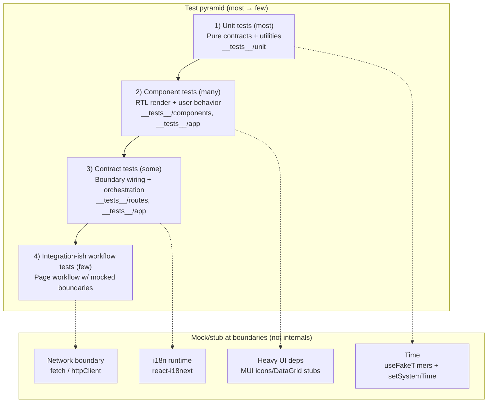

[⬅️ Back to Testing Index](./index.md)

- [Back to Overview (English)](../overview.md)
- [Zurück zum Überblick (Deutsch)](../overview-de.md)

# Testing Strategy (Layers / Pyramid)

This repo uses a pragmatic “test pyramid” optimized for a React SPA.

## Layers

### 1) Unit tests (most)

Goal: validate **pure contracts** with minimal runtime.

Typical subjects:
- utilities (formatting/parsing)
- small helpers and mappers/normalizers
- API client defaults and invariants
- i18n constants/invariants

Where:
- `frontend/src/__tests__/unit/**`

### 2) Component tests (many)

Goal: render a component with RTL and verify **observable behavior**:
- renders expected controls/content
- accessibility queries by role/name
- controlled component wiring
- user interaction → callback calls

Where:
- `frontend/src/__tests__/components/**`
- `frontend/src/__tests__/app/**` (shell components)

### 3) Contract tests (some)

Goal: verify integration boundaries without end-to-end complexity.

Examples in this repo:
- Route grouping contracts in `AppRouter` (public vs authenticated) via `MemoryRouter`.
- Shell orchestration contracts: AppShell passes expected props to Header/Sidebar, and handlers do the right side-effects.

Where:
- `frontend/src/__tests__/routes/**`
- `frontend/src/__tests__/app/**`

### 4) “Integration-ish” workflow tests (few)

Goal: validate a page workflow composition using mocks at boundaries (API layer / hook boundaries), without spinning up a real backend.

In this repo, these are still **mock-driven** and should remain deterministic.

## What we do NOT test

- MUI internals: component implementation details, layout engine behavior, CSS styling.
- React Router internals: only our route tree and our route-grouping decisions.
- i18next internals: resource loading, async backend behavior, language detector behavior.
- Browser implementation details: actual cookie/CORS behavior, real network stack.

## Determinism rules

- No real network:
  - Stub `fetch` (e.g., `vi.stubGlobal('fetch', vi.fn())`) for code that uses fetch.
  - Mock API boundaries for Axios-based modules (prefer mocking `httpClient` or domain fetchers).

- No real time:
  - Use `vi.useFakeTimers()` + `vi.setSystemTime(...)` for date/time behavior.
  - Avoid `setTimeout`-driven waits unless you also control time.

- No shared cache between tests:
  - React Query clients used in tests should not retry and should not persist cache across tests.

## Mocking policy

Allowed to mock (preferred boundaries):
- External boundaries:
  - network (`fetch`, `httpClient`)
  - i18n runtime (`react-i18next`)
  - heavy UI packages (DataGrid / icon modules are stubbed)
- Our own boundary modules when writing contract tests:
  - “orchestrator dependencies” such as `useAuth`, `useSettings`, `useHealthCheck`.

Avoid mocking:
- Our own pure logic (formatters, normalizers, validators). Test it directly.
- Internal implementation details (e.g., calling private helpers). Prefer user-observable behavior.

---

[Back to top](#top)
