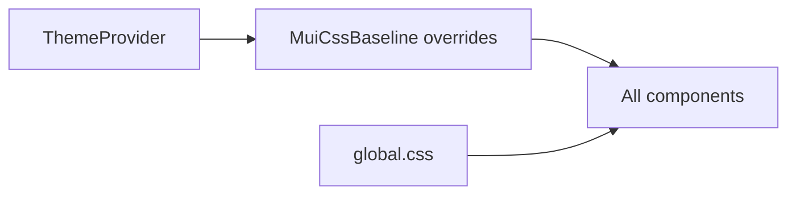

[⬅️ Back to Theme & Styling Index](./index.md)

- [Back to Overview (English)](../overview.md)
- [Zurück zum Überblick (Deutsch)](../overview-de.md)

# Global styles & CSS baseline

Most styling comes from MUI, but the repo also includes a small amount of global CSS for concerns that are awkward in component-scoped styles.

## `frontend/src/styles/global.css`

This file covers:

- full-height layout for `html, body, #root`
- webkit scrollbars (8px)
- accessibility helper class: `.visually-hidden`
- print overrides

## CssBaseline overrides

The theme also applies global-ish styles via `MuiCssBaseline.styleOverrides`.

Examples include:

- scrollbars
- body background image suppression

## Rules of thumb

- Keep global CSS small and purpose-driven.
- Prefer theme-level `CssBaseline` overrides for cross-cutting tweaks.
- Avoid introducing new ad-hoc colors or typography in CSS; use theme tokens.

---

---

[Back to top](#top)
