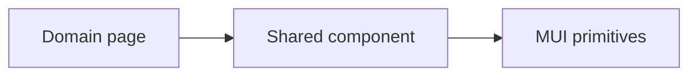

[⬅️ Back to UI & UX Building Blocks Index](./index.md)

- [Back to Overview (English)](../overview.md)
- [Zurück zum Überblick (Deutsch)](../overview-de.md)

# Shared UI components

Shared UI components live under:

- `frontend/src/components/ui/*`

These are intentionally small and composable.

## Example: `StatCard`

`StatCard` is a KPI/stat display component used for dashboards:

- uses MUI `Card`
- renders a title + value
- has a built-in loading skeleton state
- displays an em dash when value is null/undefined

Typical usage:

- `StatCard title={t('common:dashboard.kpi.totalItems')} value={count} loading={isLoading}`

## Rules of thumb

- Keep these components **domain-agnostic**.
- Prefer accepting **renderable primitives** (strings, numbers) rather than domain objects.
- If a component becomes domain-specific, move it into the domain’s feature folder.

---

---

[Back to top](#top)
